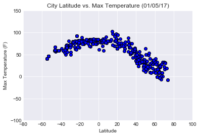
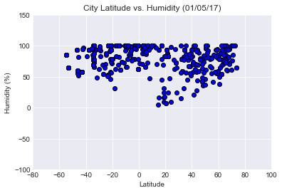
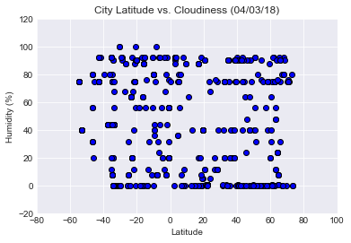

```python
# "What's the weather like as we approach the equator?"

#Observable Trend 1
#Observable Trend 2
#Observable Trend 3
```


```python
# Dependencies
import json
import requests 
import random
import numpy as np
from pprint import pprint
from config import api_key # Openweathermapy APIKEY

import matplotlib.pyplot as plt
import pandas as pd

# We might need this?
import openweathermapy.core as owm
from citipy import citipy
```


```python
# Randomly select at least 500 unique (non-repeat) cities based on latitude and longitude.

iterator = 1
total_cities = 600

city_name_list = []
country_code_list = []

while iterator <= total_cities:

    # Generate random city
    lat = random.uniform(-75, 75)
    lon = random.uniform(-180, 180)
    city = citipy.nearest_city(lat, lon)
    country_code = city.country_code
    name = city.city_name
    #print(country_code)
    #print(name)
    city_name_list.append(name)
    country_code_list.append(country_code)
    
    iterator += 1
    
```


```python
city_dict = {"City": city_name_list,
            "Country": country_code_list}
city_pd = pd.DataFrame(city_dict)
city_pd["Latitude"] = ""
city_pd["Longitude"] = ""
city_pd["Temperature"] = ""
city_pd["Humidity"] = ""
city_pd["Wind Speed"] = ""
city_pd["Cloudiness"] = ""
city_pd.head()
```


<div>
<style scoped>
    .dataframe tbody tr th:only-of-type {
        vertical-align: middle;
    }

    .dataframe tbody tr th {
        vertical-align: top;
    }

    .dataframe thead th {
        text-align: right;
    }
</style>
<table border="1" class="dataframe">
  <thead>
    <tr style="text-align: right;">
      <th></th>
      <th>City</th>
      <th>Country</th>
      <th>Latitude</th>
      <th>Longitude</th>
      <th>Temperature</th>
      <th>Humidity</th>
      <th>Wind Speed</th>
      <th>Cloudiness</th>
    </tr>
  </thead>
  <tbody>
    <tr>
      <th>0</th>
      <td>lebu</td>
      <td>cl</td>
      <td></td>
      <td></td>
      <td></td>
      <td></td>
      <td></td>
      <td></td>
    </tr>
    <tr>
      <th>1</th>
      <td>ostrovnoy</td>
      <td>ru</td>
      <td></td>
      <td></td>
      <td></td>
      <td></td>
      <td></td>
      <td></td>
    </tr>
    <tr>
      <th>2</th>
      <td>chapais</td>
      <td>ca</td>
      <td></td>
      <td></td>
      <td></td>
      <td></td>
      <td></td>
      <td></td>
    </tr>
    <tr>
      <th>3</th>
      <td>rivadavia</td>
      <td>ar</td>
      <td></td>
      <td></td>
      <td></td>
      <td></td>
      <td></td>
      <td></td>
    </tr>
    <tr>
      <th>4</th>
      <td>grand island</td>
      <td>us</td>
      <td></td>
      <td></td>
      <td></td>
      <td></td>
      <td></td>
      <td></td>
    </tr>
  </tbody>
</table>
</div>


```python
# Perform a weather check on each of the cities using a series of successive API calls.
# Include a print log of each city as it's being processed with the city number, city name, and requested URL.
# URL Setup and Settings
url = "http://api.openweathermap.org/data/2.5/weather?"
units = "imperial"
query_url = f"{url}appid={api_key}&units={units}&q="

count = 1

# Loop through the cities_pd and run a lat/long search for each city
for index, row in city_pd.iterrows():

    city = row['City']
    country = row['Country']
    
    #Get weather data
    weather_response = requests.get(query_url + city + "," + country)
    weather_json = weather_response.json()
    
    print(f"Requesting current weather data for city #{count} {city}, {country}  ")
    print("URL: "+ weather_response.url)
    print()
    
    try:
        city_pd.at[index, "Latitude"] = weather_json['coord']['lat']
        city_pd.at[index, "Longitude"] = weather_json['coord']['lon']
        city_pd.at[index, "Temperature"] = weather_json['main']['temp']
        city_pd.at[index, "Humidity"] = weather_json['main']['humidity']
        city_pd.at[index, "Wind Speed"] = weather_json['wind']['speed']
        city_pd.at[index, "Cloudiness"] = weather_json['clouds']['all']
    
    except (KeyError):
        print("Missing field/result... skipping.")
        print()
        
    count += 1
    
```

    Requesting current weather data for city #1 lebu, cl  
    URL: http://api.openweathermap.org/data/2.5/weather?appid=290aa35543e1009d711476e20ccfc318&units=imperial&q=lebu,cl
    
    Requesting current weather data for city #2 ostrovnoy, ru  
    URL: http://api.openweathermap.org/data/2.5/weather?appid=290aa35543e1009d711476e20ccfc318&units=imperial&q=ostrovnoy,ru
    
    Requesting current weather data for city #3 chapais, ca  
    URL: http://api.openweathermap.org/data/2.5/weather?appid=290aa35543e1009d711476e20ccfc318&units=imperial&q=chapais,ca
    
    Requesting current weather data for city #4 rivadavia, ar  
    URL: http://api.openweathermap.org/data/2.5/weather?appid=290aa35543e1009d711476e20ccfc318&units=imperial&q=rivadavia,ar
    
    Requesting current weather data for city #5 grand island, us  
    URL: http://api.openweathermap.org/data/2.5/weather?appid=290aa35543e1009d711476e20ccfc318&units=imperial&q=grand%20island,us
    
    Requesting current weather data for city #6 vao, nc  
    URL: http://api.openweathermap.org/data/2.5/weather?appid=290aa35543e1009d711476e20ccfc318&units=imperial&q=vao,nc
    
    Requesting current weather data for city #7 barrow, us  
    URL: http://api.openweathermap.org/data/2.5/weather?appid=290aa35543e1009d711476e20ccfc318&units=imperial&q=barrow,us
    
    Requesting current weather data for city #8 kavieng, pg  
    URL: http://api.openweathermap.org/data/2.5/weather?appid=290aa35543e1009d711476e20ccfc318&units=imperial&q=kavieng,pg
    
    Requesting current weather data for city #9 puerto ayora, ec  
    URL: http://api.openweathermap.org/data/2.5/weather?appid=290aa35543e1009d711476e20ccfc318&units=imperial&q=puerto%20ayora,ec
    
    Requesting current weather data for city #10 seymchan, ru  
    URL: http://api.openweathermap.org/data/2.5/weather?appid=290aa35543e1009d711476e20ccfc318&units=imperial&q=seymchan,ru
    
    Requesting current weather data for city #11 busselton, au  
    URL: http://api.openweathermap.org/data/2.5/weather?appid=290aa35543e1009d711476e20ccfc318&units=imperial&q=busselton,au
    
    Requesting current weather data for city #12 half moon bay, us  
    URL: http://api.openweathermap.org/data/2.5/weather?appid=290aa35543e1009d711476e20ccfc318&units=imperial&q=half%20moon%20bay,us
    
    Requesting current weather data for city #13 faanui, pf  
    URL: http://api.openweathermap.org/data/2.5/weather?appid=290aa35543e1009d711476e20ccfc318&units=imperial&q=faanui,pf
    
    Requesting current weather data for city #14 tsihombe, mg  
    URL: http://api.openweathermap.org/data/2.5/weather?appid=290aa35543e1009d711476e20ccfc318&units=imperial&q=tsihombe,mg
    
    Missing field/result... skipping.
    
    Requesting current weather data for city #15 arraial do cabo, br  
    URL: http://api.openweathermap.org/data/2.5/weather?appid=290aa35543e1009d711476e20ccfc318&units=imperial&q=arraial%20do%20cabo,br
    
    Requesting current weather data for city #16 talmenka, ru  
    URL: http://api.openweathermap.org/data/2.5/weather?appid=290aa35543e1009d711476e20ccfc318&units=imperial&q=talmenka,ru
    
    Requesting current weather data for city #17 namatanai, pg  
    URL: http://api.openweathermap.org/data/2.5/weather?appid=290aa35543e1009d711476e20ccfc318&units=imperial&q=namatanai,pg
    
    Requesting current weather data for city #18 beringovskiy, ru  
    URL: http://api.openweathermap.org/data/2.5/weather?appid=290aa35543e1009d711476e20ccfc318&units=imperial&q=beringovskiy,ru
    
    Requesting current weather data for city #19 inuvik, ca  
    URL: http://api.openweathermap.org/data/2.5/weather?appid=290aa35543e1009d711476e20ccfc318&units=imperial&q=inuvik,ca
    
    Requesting current weather data for city #20 kurilsk, ru  
    URL: http://api.openweathermap.org/data/2.5/weather?appid=290aa35543e1009d711476e20ccfc318&units=imperial&q=kurilsk,ru
    
    Requesting current weather data for city #21 kruisfontein, za  
    URL: http://api.openweathermap.org/data/2.5/weather?appid=290aa35543e1009d711476e20ccfc318&units=imperial&q=kruisfontein,za
    
    Requesting current weather data for city #22 atuona, pf  
    URL: http://api.openweathermap.org/data/2.5/weather?appid=290aa35543e1009d711476e20ccfc318&units=imperial&q=atuona,pf
    
    Requesting current weather data for city #23 anadyr, ru  
    URL: http://api.openweathermap.org/data/2.5/weather?appid=290aa35543e1009d711476e20ccfc318&units=imperial&q=anadyr,ru
    
    Requesting current weather data for city #24 provideniya, ru  
    URL: http://api.openweathermap.org/data/2.5/weather?appid=290aa35543e1009d711476e20ccfc318&units=imperial&q=provideniya,ru
    
    Requesting current weather data for city #25 sao sebastiao, br  
    URL: http://api.openweathermap.org/data/2.5/weather?appid=290aa35543e1009d711476e20ccfc318&units=imperial&q=sao%20sebastiao,br
    
    Requesting current weather data for city #26 cape town, za  
    URL: http://api.openweathermap.org/data/2.5/weather?appid=290aa35543e1009d711476e20ccfc318&units=imperial&q=cape%20town,za
    
    Requesting current weather data for city #27 hobart, au  
    URL: http://api.openweathermap.org/data/2.5/weather?appid=290aa35543e1009d711476e20ccfc318&units=imperial&q=hobart,au
    
    Requesting current weather data for city #28 araouane, ml  
    URL: http://api.openweathermap.org/data/2.5/weather?appid=290aa35543e1009d711476e20ccfc318&units=imperial&q=araouane,ml
    
    Requesting current weather data for city #29 rikitea, pf  
    URL: http://api.openweathermap.org/data/2.5/weather?appid=290aa35543e1009d711476e20ccfc318&units=imperial&q=rikitea,pf
    
    Requesting current weather data for city #30 inverell, au  
    URL: http://api.openweathermap.org/data/2.5/weather?appid=290aa35543e1009d711476e20ccfc318&units=imperial&q=inverell,au
    
    Requesting current weather data for city #31 mataura, pf  
    URL: http://api.openweathermap.org/data/2.5/weather?appid=290aa35543e1009d711476e20ccfc318&units=imperial&q=mataura,pf
    
    Missing field/result... skipping.
    
    Requesting current weather data for city #32 praskoveya, ru  
    URL: http://api.openweathermap.org/data/2.5/weather?appid=290aa35543e1009d711476e20ccfc318&units=imperial&q=praskoveya,ru
    
    Requesting current weather data for city #33 praia da vitoria, pt  
    URL: http://api.openweathermap.org/data/2.5/weather?appid=290aa35543e1009d711476e20ccfc318&units=imperial&q=praia%20da%20vitoria,pt
    
    Requesting current weather data for city #34 hilo, us  
    URL: http://api.openweathermap.org/data/2.5/weather?appid=290aa35543e1009d711476e20ccfc318&units=imperial&q=hilo,us
    
    Requesting current weather data for city #35 vaini, to  
    URL: http://api.openweathermap.org/data/2.5/weather?appid=290aa35543e1009d711476e20ccfc318&units=imperial&q=vaini,to
    
    Requesting current weather data for city #36 port elizabeth, za  
    URL: http://api.openweathermap.org/data/2.5/weather?appid=290aa35543e1009d711476e20ccfc318&units=imperial&q=port%20elizabeth,za
    
    Requesting current weather data for city #37 skjervoy, no  
    URL: http://api.openweathermap.org/data/2.5/weather?appid=290aa35543e1009d711476e20ccfc318&units=imperial&q=skjervoy,no
    
    Requesting current weather data for city #38 rikitea, pf  
    URL: http://api.openweathermap.org/data/2.5/weather?appid=290aa35543e1009d711476e20ccfc318&units=imperial&q=rikitea,pf
    
    Requesting current weather data for city #39 kirakira, sb  
    URL: http://api.openweathermap.org/data/2.5/weather?appid=290aa35543e1009d711476e20ccfc318&units=imperial&q=kirakira,sb
    
    Requesting current weather data for city #40 cape town, za  
    URL: http://api.openweathermap.org/data/2.5/weather?appid=290aa35543e1009d711476e20ccfc318&units=imperial&q=cape%20town,za
    
    Requesting current weather data for city #41 high level, ca  
    URL: http://api.openweathermap.org/data/2.5/weather?appid=290aa35543e1009d711476e20ccfc318&units=imperial&q=high%20level,ca
    
    Requesting current weather data for city #42 hermanus, za  
    URL: http://api.openweathermap.org/data/2.5/weather?appid=290aa35543e1009d711476e20ccfc318&units=imperial&q=hermanus,za
    
    Requesting current weather data for city #43 cape town, za  
    URL: http://api.openweathermap.org/data/2.5/weather?appid=290aa35543e1009d711476e20ccfc318&units=imperial&q=cape%20town,za
    
    Requesting current weather data for city #44 artyk, ru  
    URL: http://api.openweathermap.org/data/2.5/weather?appid=290aa35543e1009d711476e20ccfc318&units=imperial&q=artyk,ru
    
    Missing field/result... skipping.
    
    Requesting current weather data for city #45 guerrero negro, mx  
    URL: http://api.openweathermap.org/data/2.5/weather?appid=290aa35543e1009d711476e20ccfc318&units=imperial&q=guerrero%20negro,mx
    
    Requesting current weather data for city #46 ushuaia, ar  
    URL: http://api.openweathermap.org/data/2.5/weather?appid=290aa35543e1009d711476e20ccfc318&units=imperial&q=ushuaia,ar
    
    Requesting current weather data for city #47 rikitea, pf  
    URL: http://api.openweathermap.org/data/2.5/weather?appid=290aa35543e1009d711476e20ccfc318&units=imperial&q=rikitea,pf
    
    Requesting current weather data for city #48 ponta do sol, cv  
    URL: http://api.openweathermap.org/data/2.5/weather?appid=290aa35543e1009d711476e20ccfc318&units=imperial&q=ponta%20do%20sol,cv
    
    Requesting current weather data for city #49 olafsvik, is  
    URL: http://api.openweathermap.org/data/2.5/weather?appid=290aa35543e1009d711476e20ccfc318&units=imperial&q=olafsvik,is
    
    Missing field/result... skipping.
    
    Requesting current weather data for city #50 borgo san dalmazzo, it  
    URL: http://api.openweathermap.org/data/2.5/weather?appid=290aa35543e1009d711476e20ccfc318&units=imperial&q=borgo%20san%20dalmazzo,it
    
    Requesting current weather data for city #51 port alfred, za  
    URL: http://api.openweathermap.org/data/2.5/weather?appid=290aa35543e1009d711476e20ccfc318&units=imperial&q=port%20alfred,za
    
    Requesting current weather data for city #52 tsihombe, mg  
    URL: http://api.openweathermap.org/data/2.5/weather?appid=290aa35543e1009d711476e20ccfc318&units=imperial&q=tsihombe,mg
    
    Missing field/result... skipping.
    
    Requesting current weather data for city #53 maceio, br  
    URL: http://api.openweathermap.org/data/2.5/weather?appid=290aa35543e1009d711476e20ccfc318&units=imperial&q=maceio,br
    
    Requesting current weather data for city #54 evensk, ru  
    URL: http://api.openweathermap.org/data/2.5/weather?appid=290aa35543e1009d711476e20ccfc318&units=imperial&q=evensk,ru
    
    Requesting current weather data for city #55 kahului, us  
    URL: http://api.openweathermap.org/data/2.5/weather?appid=290aa35543e1009d711476e20ccfc318&units=imperial&q=kahului,us
    
    Requesting current weather data for city #56 kodiak, us  
    URL: http://api.openweathermap.org/data/2.5/weather?appid=290aa35543e1009d711476e20ccfc318&units=imperial&q=kodiak,us
    
    Requesting current weather data for city #57 chuy, uy  
    URL: http://api.openweathermap.org/data/2.5/weather?appid=290aa35543e1009d711476e20ccfc318&units=imperial&q=chuy,uy
    
    Requesting current weather data for city #58 college, us  
    URL: http://api.openweathermap.org/data/2.5/weather?appid=290aa35543e1009d711476e20ccfc318&units=imperial&q=college,us
    
    Requesting current weather data for city #59 ust-bolsheretsk, ru  
    URL: http://api.openweathermap.org/data/2.5/weather?appid=290aa35543e1009d711476e20ccfc318&units=imperial&q=ust-bolsheretsk,ru
    
    Missing field/result... skipping.
    
    Requesting current weather data for city #60 hermanus, za  
    URL: http://api.openweathermap.org/data/2.5/weather?appid=290aa35543e1009d711476e20ccfc318&units=imperial&q=hermanus,za
    
    Requesting current weather data for city #61 cape town, za  
    URL: http://api.openweathermap.org/data/2.5/weather?appid=290aa35543e1009d711476e20ccfc318&units=imperial&q=cape%20town,za
    
    Requesting current weather data for city #62 caconde, br  
    URL: http://api.openweathermap.org/data/2.5/weather?appid=290aa35543e1009d711476e20ccfc318&units=imperial&q=caconde,br
    
    Requesting current weather data for city #63 villarrica, cl  
    URL: http://api.openweathermap.org/data/2.5/weather?appid=290aa35543e1009d711476e20ccfc318&units=imperial&q=villarrica,cl
    
    Requesting current weather data for city #64 lucapa, ao  
    URL: http://api.openweathermap.org/data/2.5/weather?appid=290aa35543e1009d711476e20ccfc318&units=imperial&q=lucapa,ao
    
    Requesting current weather data for city #65 qui nhon, vn  
    URL: http://api.openweathermap.org/data/2.5/weather?appid=290aa35543e1009d711476e20ccfc318&units=imperial&q=qui%20nhon,vn
    
    Missing field/result... skipping.
    
    Requesting current weather data for city #66 bengkulu, id  
    URL: http://api.openweathermap.org/data/2.5/weather?appid=290aa35543e1009d711476e20ccfc318&units=imperial&q=bengkulu,id
    
    Missing field/result... skipping.
    
    Requesting current weather data for city #67 vaini, to  
    URL: http://api.openweathermap.org/data/2.5/weather?appid=290aa35543e1009d711476e20ccfc318&units=imperial&q=vaini,to
    
    Requesting current weather data for city #68 padang, id  
    URL: http://api.openweathermap.org/data/2.5/weather?appid=290aa35543e1009d711476e20ccfc318&units=imperial&q=padang,id
    
    Requesting current weather data for city #69 faanui, pf  
    URL: http://api.openweathermap.org/data/2.5/weather?appid=290aa35543e1009d711476e20ccfc318&units=imperial&q=faanui,pf
    
    Requesting current weather data for city #70 mount isa, au  
    URL: http://api.openweathermap.org/data/2.5/weather?appid=290aa35543e1009d711476e20ccfc318&units=imperial&q=mount%20isa,au
    
    Requesting current weather data for city #71 pisco, pe  
    URL: http://api.openweathermap.org/data/2.5/weather?appid=290aa35543e1009d711476e20ccfc318&units=imperial&q=pisco,pe
    
    Requesting current weather data for city #72 codrington, ag  
    URL: http://api.openweathermap.org/data/2.5/weather?appid=290aa35543e1009d711476e20ccfc318&units=imperial&q=codrington,ag
    
    Missing field/result... skipping.
    
    Requesting current weather data for city #73 bolungarvik, is  
    URL: http://api.openweathermap.org/data/2.5/weather?appid=290aa35543e1009d711476e20ccfc318&units=imperial&q=bolungarvik,is
    
    Missing field/result... skipping.
    
    Requesting current weather data for city #74 tsihombe, mg  
    URL: http://api.openweathermap.org/data/2.5/weather?appid=290aa35543e1009d711476e20ccfc318&units=imperial&q=tsihombe,mg
    
    Missing field/result... skipping.
    
    Requesting current weather data for city #75 atuona, pf  
    URL: http://api.openweathermap.org/data/2.5/weather?appid=290aa35543e1009d711476e20ccfc318&units=imperial&q=atuona,pf
    
    Requesting current weather data for city #76 zhigansk, ru  
    URL: http://api.openweathermap.org/data/2.5/weather?appid=290aa35543e1009d711476e20ccfc318&units=imperial&q=zhigansk,ru
    
    Requesting current weather data for city #77 stromness, gb  
    URL: http://api.openweathermap.org/data/2.5/weather?appid=290aa35543e1009d711476e20ccfc318&units=imperial&q=stromness,gb
    
    Requesting current weather data for city #78 biak, id  
    URL: http://api.openweathermap.org/data/2.5/weather?appid=290aa35543e1009d711476e20ccfc318&units=imperial&q=biak,id
    
    Requesting current weather data for city #79 ushuaia, ar  
    URL: http://api.openweathermap.org/data/2.5/weather?appid=290aa35543e1009d711476e20ccfc318&units=imperial&q=ushuaia,ar
    
    Requesting current weather data for city #80 severo-kurilsk, ru  
    URL: http://api.openweathermap.org/data/2.5/weather?appid=290aa35543e1009d711476e20ccfc318&units=imperial&q=severo-kurilsk,ru
    
    Requesting current weather data for city #81 kaitangata, nz  
    URL: http://api.openweathermap.org/data/2.5/weather?appid=290aa35543e1009d711476e20ccfc318&units=imperial&q=kaitangata,nz
    
    Requesting current weather data for city #82 portel, br  
    URL: http://api.openweathermap.org/data/2.5/weather?appid=290aa35543e1009d711476e20ccfc318&units=imperial&q=portel,br
    
    Requesting current weather data for city #83 katsuura, jp  
    URL: http://api.openweathermap.org/data/2.5/weather?appid=290aa35543e1009d711476e20ccfc318&units=imperial&q=katsuura,jp
    
    Requesting current weather data for city #84 espanola, us  
    URL: http://api.openweathermap.org/data/2.5/weather?appid=290aa35543e1009d711476e20ccfc318&units=imperial&q=espanola,us
    
    Requesting current weather data for city #85 faanui, pf  
    URL: http://api.openweathermap.org/data/2.5/weather?appid=290aa35543e1009d711476e20ccfc318&units=imperial&q=faanui,pf
    
    Requesting current weather data for city #86 faro, pt  
    URL: http://api.openweathermap.org/data/2.5/weather?appid=290aa35543e1009d711476e20ccfc318&units=imperial&q=faro,pt
    
    Requesting current weather data for city #87 bredasdorp, za  
    URL: http://api.openweathermap.org/data/2.5/weather?appid=290aa35543e1009d711476e20ccfc318&units=imperial&q=bredasdorp,za
    
    Requesting current weather data for city #88 eyl, so  
    URL: http://api.openweathermap.org/data/2.5/weather?appid=290aa35543e1009d711476e20ccfc318&units=imperial&q=eyl,so
    
    Requesting current weather data for city #89 port alfred, za  
    URL: http://api.openweathermap.org/data/2.5/weather?appid=290aa35543e1009d711476e20ccfc318&units=imperial&q=port%20alfred,za
    
    Requesting current weather data for city #90 ushuaia, ar  
    URL: http://api.openweathermap.org/data/2.5/weather?appid=290aa35543e1009d711476e20ccfc318&units=imperial&q=ushuaia,ar
    
    Requesting current weather data for city #91 ponta do sol, cv  
    URL: http://api.openweathermap.org/data/2.5/weather?appid=290aa35543e1009d711476e20ccfc318&units=imperial&q=ponta%20do%20sol,cv
    
    Requesting current weather data for city #92 kharp, ru  
    URL: http://api.openweathermap.org/data/2.5/weather?appid=290aa35543e1009d711476e20ccfc318&units=imperial&q=kharp,ru
    
    Requesting current weather data for city #93 nichinan, jp  
    URL: http://api.openweathermap.org/data/2.5/weather?appid=290aa35543e1009d711476e20ccfc318&units=imperial&q=nichinan,jp
    
    Requesting current weather data for city #94 busselton, au  
    URL: http://api.openweathermap.org/data/2.5/weather?appid=290aa35543e1009d711476e20ccfc318&units=imperial&q=busselton,au
    
    Requesting current weather data for city #95 kapaa, us  
    URL: http://api.openweathermap.org/data/2.5/weather?appid=290aa35543e1009d711476e20ccfc318&units=imperial&q=kapaa,us
    
    Requesting current weather data for city #96 yellowknife, ca  
    URL: http://api.openweathermap.org/data/2.5/weather?appid=290aa35543e1009d711476e20ccfc318&units=imperial&q=yellowknife,ca
    
    Requesting current weather data for city #97 mataura, pf  
    URL: http://api.openweathermap.org/data/2.5/weather?appid=290aa35543e1009d711476e20ccfc318&units=imperial&q=mataura,pf
    
    Missing field/result... skipping.
    
    Requesting current weather data for city #98 kavieng, pg  
    URL: http://api.openweathermap.org/data/2.5/weather?appid=290aa35543e1009d711476e20ccfc318&units=imperial&q=kavieng,pg
    
    Requesting current weather data for city #99 airai, pw  
    URL: http://api.openweathermap.org/data/2.5/weather?appid=290aa35543e1009d711476e20ccfc318&units=imperial&q=airai,pw
    
    Missing field/result... skipping.
    
    Requesting current weather data for city #100 east london, za  
    URL: http://api.openweathermap.org/data/2.5/weather?appid=290aa35543e1009d711476e20ccfc318&units=imperial&q=east%20london,za
    
    Requesting current weather data for city #101 mersing, my  
    URL: http://api.openweathermap.org/data/2.5/weather?appid=290aa35543e1009d711476e20ccfc318&units=imperial&q=mersing,my
    
    Requesting current weather data for city #102 avarua, ck  
    URL: http://api.openweathermap.org/data/2.5/weather?appid=290aa35543e1009d711476e20ccfc318&units=imperial&q=avarua,ck
    
    Requesting current weather data for city #103 sentyabrskiy, ru  
    URL: http://api.openweathermap.org/data/2.5/weather?appid=290aa35543e1009d711476e20ccfc318&units=imperial&q=sentyabrskiy,ru
    
    Missing field/result... skipping.
    
    Requesting current weather data for city #104 miraflores, co  
    URL: http://api.openweathermap.org/data/2.5/weather?appid=290aa35543e1009d711476e20ccfc318&units=imperial&q=miraflores,co
    
    Requesting current weather data for city #105 bredasdorp, za  
    URL: http://api.openweathermap.org/data/2.5/weather?appid=290aa35543e1009d711476e20ccfc318&units=imperial&q=bredasdorp,za
    
    Requesting current weather data for city #106 vaini, to  
    URL: http://api.openweathermap.org/data/2.5/weather?appid=290aa35543e1009d711476e20ccfc318&units=imperial&q=vaini,to
    
    Requesting current weather data for city #107 hithadhoo, mv  
    URL: http://api.openweathermap.org/data/2.5/weather?appid=290aa35543e1009d711476e20ccfc318&units=imperial&q=hithadhoo,mv
    
    Requesting current weather data for city #108 rikitea, pf  
    URL: http://api.openweathermap.org/data/2.5/weather?appid=290aa35543e1009d711476e20ccfc318&units=imperial&q=rikitea,pf
    
    Requesting current weather data for city #109 batagay-alyta, ru  
    URL: http://api.openweathermap.org/data/2.5/weather?appid=290aa35543e1009d711476e20ccfc318&units=imperial&q=batagay-alyta,ru
    
    Requesting current weather data for city #110 rikitea, pf  
    URL: http://api.openweathermap.org/data/2.5/weather?appid=290aa35543e1009d711476e20ccfc318&units=imperial&q=rikitea,pf
    
    Requesting current weather data for city #111 jamestown, sh  
    URL: http://api.openweathermap.org/data/2.5/weather?appid=290aa35543e1009d711476e20ccfc318&units=imperial&q=jamestown,sh
    
    Requesting current weather data for city #112 mataura, pf  
    URL: http://api.openweathermap.org/data/2.5/weather?appid=290aa35543e1009d711476e20ccfc318&units=imperial&q=mataura,pf
    
    Missing field/result... skipping.
    
    Requesting current weather data for city #113 sao joao da barra, br  
    URL: http://api.openweathermap.org/data/2.5/weather?appid=290aa35543e1009d711476e20ccfc318&units=imperial&q=sao%20joao%20da%20barra,br
    
    Requesting current weather data for city #114 souillac, mu  
    URL: http://api.openweathermap.org/data/2.5/weather?appid=290aa35543e1009d711476e20ccfc318&units=imperial&q=souillac,mu
    
    Requesting current weather data for city #115 bilma, ne  
    URL: http://api.openweathermap.org/data/2.5/weather?appid=290aa35543e1009d711476e20ccfc318&units=imperial&q=bilma,ne
    
    Requesting current weather data for city #116 nikolskoye, ru  
    URL: http://api.openweathermap.org/data/2.5/weather?appid=290aa35543e1009d711476e20ccfc318&units=imperial&q=nikolskoye,ru
    
    Requesting current weather data for city #117 mahebourg, mu  
    URL: http://api.openweathermap.org/data/2.5/weather?appid=290aa35543e1009d711476e20ccfc318&units=imperial&q=mahebourg,mu
    
    Requesting current weather data for city #118 bandarbeyla, so  
    URL: http://api.openweathermap.org/data/2.5/weather?appid=290aa35543e1009d711476e20ccfc318&units=imperial&q=bandarbeyla,so
    
    Requesting current weather data for city #119 bandar penggaram, my  
    URL: http://api.openweathermap.org/data/2.5/weather?appid=290aa35543e1009d711476e20ccfc318&units=imperial&q=bandar%20penggaram,my
    
    Missing field/result... skipping.
    
    Requesting current weather data for city #120 vaini, to  
    URL: http://api.openweathermap.org/data/2.5/weather?appid=290aa35543e1009d711476e20ccfc318&units=imperial&q=vaini,to
    
    Requesting current weather data for city #121 samusu, ws  
    URL: http://api.openweathermap.org/data/2.5/weather?appid=290aa35543e1009d711476e20ccfc318&units=imperial&q=samusu,ws
    
    Missing field/result... skipping.
    
    Requesting current weather data for city #122 hilo, us  
    URL: http://api.openweathermap.org/data/2.5/weather?appid=290aa35543e1009d711476e20ccfc318&units=imperial&q=hilo,us
    
    Requesting current weather data for city #123 chokurdakh, ru  
    URL: http://api.openweathermap.org/data/2.5/weather?appid=290aa35543e1009d711476e20ccfc318&units=imperial&q=chokurdakh,ru
    
    Requesting current weather data for city #124 punta arenas, cl  
    URL: http://api.openweathermap.org/data/2.5/weather?appid=290aa35543e1009d711476e20ccfc318&units=imperial&q=punta%20arenas,cl
    
    Requesting current weather data for city #125 souillac, mu  
    URL: http://api.openweathermap.org/data/2.5/weather?appid=290aa35543e1009d711476e20ccfc318&units=imperial&q=souillac,mu
    
    Requesting current weather data for city #126 tuxpan, mx  
    URL: http://api.openweathermap.org/data/2.5/weather?appid=290aa35543e1009d711476e20ccfc318&units=imperial&q=tuxpan,mx
    
    Requesting current weather data for city #127 kirakira, sb  
    URL: http://api.openweathermap.org/data/2.5/weather?appid=290aa35543e1009d711476e20ccfc318&units=imperial&q=kirakira,sb
    
    Requesting current weather data for city #128 dikson, ru  
    URL: http://api.openweathermap.org/data/2.5/weather?appid=290aa35543e1009d711476e20ccfc318&units=imperial&q=dikson,ru
    
    Requesting current weather data for city #129 severo-kurilsk, ru  
    URL: http://api.openweathermap.org/data/2.5/weather?appid=290aa35543e1009d711476e20ccfc318&units=imperial&q=severo-kurilsk,ru
    
    Requesting current weather data for city #130 lolua, tv  
    URL: http://api.openweathermap.org/data/2.5/weather?appid=290aa35543e1009d711476e20ccfc318&units=imperial&q=lolua,tv
    
    Missing field/result... skipping.
    
    Requesting current weather data for city #131 rabo de peixe, pt  
    URL: http://api.openweathermap.org/data/2.5/weather?appid=290aa35543e1009d711476e20ccfc318&units=imperial&q=rabo%20de%20peixe,pt
    
    Requesting current weather data for city #132 punta arenas, cl  
    URL: http://api.openweathermap.org/data/2.5/weather?appid=290aa35543e1009d711476e20ccfc318&units=imperial&q=punta%20arenas,cl
    
    Requesting current weather data for city #133 tabou, ci  
    URL: http://api.openweathermap.org/data/2.5/weather?appid=290aa35543e1009d711476e20ccfc318&units=imperial&q=tabou,ci
    
    Requesting current weather data for city #134 havoysund, no  
    URL: http://api.openweathermap.org/data/2.5/weather?appid=290aa35543e1009d711476e20ccfc318&units=imperial&q=havoysund,no
    
    Requesting current weather data for city #135 kununurra, au  
    URL: http://api.openweathermap.org/data/2.5/weather?appid=290aa35543e1009d711476e20ccfc318&units=imperial&q=kununurra,au
    
    Requesting current weather data for city #136 san quintin, mx  
    URL: http://api.openweathermap.org/data/2.5/weather?appid=290aa35543e1009d711476e20ccfc318&units=imperial&q=san%20quintin,mx
    
    Missing field/result... skipping.
    
    Requesting current weather data for city #137 rikitea, pf  
    URL: http://api.openweathermap.org/data/2.5/weather?appid=290aa35543e1009d711476e20ccfc318&units=imperial&q=rikitea,pf
    
    Requesting current weather data for city #138 wawa, ca  
    URL: http://api.openweathermap.org/data/2.5/weather?appid=290aa35543e1009d711476e20ccfc318&units=imperial&q=wawa,ca
    
    Requesting current weather data for city #139 kommunisticheskiy, ru  
    URL: http://api.openweathermap.org/data/2.5/weather?appid=290aa35543e1009d711476e20ccfc318&units=imperial&q=kommunisticheskiy,ru
    
    Requesting current weather data for city #140 chumikan, ru  
    URL: http://api.openweathermap.org/data/2.5/weather?appid=290aa35543e1009d711476e20ccfc318&units=imperial&q=chumikan,ru
    
    Requesting current weather data for city #141 fortuna, us  
    URL: http://api.openweathermap.org/data/2.5/weather?appid=290aa35543e1009d711476e20ccfc318&units=imperial&q=fortuna,us
    
    Requesting current weather data for city #142 chagda, ru  
    URL: http://api.openweathermap.org/data/2.5/weather?appid=290aa35543e1009d711476e20ccfc318&units=imperial&q=chagda,ru
    
    Missing field/result... skipping.
    
    Requesting current weather data for city #143 lebu, cl  
    URL: http://api.openweathermap.org/data/2.5/weather?appid=290aa35543e1009d711476e20ccfc318&units=imperial&q=lebu,cl
    
    Requesting current weather data for city #144 katsuura, jp  
    URL: http://api.openweathermap.org/data/2.5/weather?appid=290aa35543e1009d711476e20ccfc318&units=imperial&q=katsuura,jp
    
    Requesting current weather data for city #145 geghamasar, am  
    URL: http://api.openweathermap.org/data/2.5/weather?appid=290aa35543e1009d711476e20ccfc318&units=imperial&q=geghamasar,am
    
    Requesting current weather data for city #146 otjiwarongo, na  
    URL: http://api.openweathermap.org/data/2.5/weather?appid=290aa35543e1009d711476e20ccfc318&units=imperial&q=otjiwarongo,na
    
    Requesting current weather data for city #147 palana, ru  
    URL: http://api.openweathermap.org/data/2.5/weather?appid=290aa35543e1009d711476e20ccfc318&units=imperial&q=palana,ru
    
    Requesting current weather data for city #148 umzimvubu, za  
    URL: http://api.openweathermap.org/data/2.5/weather?appid=290aa35543e1009d711476e20ccfc318&units=imperial&q=umzimvubu,za
    
    Missing field/result... skipping.
    
    Requesting current weather data for city #149 lososina, ru  
    URL: http://api.openweathermap.org/data/2.5/weather?appid=290aa35543e1009d711476e20ccfc318&units=imperial&q=lososina,ru
    
    Requesting current weather data for city #150 mataura, pf  
    URL: http://api.openweathermap.org/data/2.5/weather?appid=290aa35543e1009d711476e20ccfc318&units=imperial&q=mataura,pf
    
    Missing field/result... skipping.
    
    Requesting current weather data for city #151 flinders, au  
    URL: http://api.openweathermap.org/data/2.5/weather?appid=290aa35543e1009d711476e20ccfc318&units=imperial&q=flinders,au
    
    Requesting current weather data for city #152 jamestown, sh  
    URL: http://api.openweathermap.org/data/2.5/weather?appid=290aa35543e1009d711476e20ccfc318&units=imperial&q=jamestown,sh
    
    Requesting current weather data for city #153 lompoc, us  
    URL: http://api.openweathermap.org/data/2.5/weather?appid=290aa35543e1009d711476e20ccfc318&units=imperial&q=lompoc,us
    
    Requesting current weather data for city #154 saint-joseph, re  
    URL: http://api.openweathermap.org/data/2.5/weather?appid=290aa35543e1009d711476e20ccfc318&units=imperial&q=saint-joseph,re
    
    Requesting current weather data for city #155 asau, tv  
    URL: http://api.openweathermap.org/data/2.5/weather?appid=290aa35543e1009d711476e20ccfc318&units=imperial&q=asau,tv
    
    Missing field/result... skipping.
    
    Requesting current weather data for city #156 hermanus, za  
    URL: http://api.openweathermap.org/data/2.5/weather?appid=290aa35543e1009d711476e20ccfc318&units=imperial&q=hermanus,za
    
    Requesting current weather data for city #157 muzhi, ru  
    URL: http://api.openweathermap.org/data/2.5/weather?appid=290aa35543e1009d711476e20ccfc318&units=imperial&q=muzhi,ru
    
    Requesting current weather data for city #158 jamestown, sh  
    URL: http://api.openweathermap.org/data/2.5/weather?appid=290aa35543e1009d711476e20ccfc318&units=imperial&q=jamestown,sh
    
    Requesting current weather data for city #159 bredasdorp, za  
    URL: http://api.openweathermap.org/data/2.5/weather?appid=290aa35543e1009d711476e20ccfc318&units=imperial&q=bredasdorp,za
    
    Requesting current weather data for city #160 ponta do sol, pt  
    URL: http://api.openweathermap.org/data/2.5/weather?appid=290aa35543e1009d711476e20ccfc318&units=imperial&q=ponta%20do%20sol,pt
    
    Requesting current weather data for city #161 rikitea, pf  
    URL: http://api.openweathermap.org/data/2.5/weather?appid=290aa35543e1009d711476e20ccfc318&units=imperial&q=rikitea,pf
    
    Requesting current weather data for city #162 new norfolk, au  
    URL: http://api.openweathermap.org/data/2.5/weather?appid=290aa35543e1009d711476e20ccfc318&units=imperial&q=new%20norfolk,au
    
    Requesting current weather data for city #163 cape town, za  
    URL: http://api.openweathermap.org/data/2.5/weather?appid=290aa35543e1009d711476e20ccfc318&units=imperial&q=cape%20town,za
    
    Requesting current weather data for city #164 college, us  
    URL: http://api.openweathermap.org/data/2.5/weather?appid=290aa35543e1009d711476e20ccfc318&units=imperial&q=college,us
    
    Requesting current weather data for city #165 pitimbu, br  
    URL: http://api.openweathermap.org/data/2.5/weather?appid=290aa35543e1009d711476e20ccfc318&units=imperial&q=pitimbu,br
    
    Requesting current weather data for city #166 ponta do sol, pt  
    URL: http://api.openweathermap.org/data/2.5/weather?appid=290aa35543e1009d711476e20ccfc318&units=imperial&q=ponta%20do%20sol,pt
    
    Requesting current weather data for city #167 richards bay, za  
    URL: http://api.openweathermap.org/data/2.5/weather?appid=290aa35543e1009d711476e20ccfc318&units=imperial&q=richards%20bay,za
    
    Requesting current weather data for city #168 port-gentil, ga  
    URL: http://api.openweathermap.org/data/2.5/weather?appid=290aa35543e1009d711476e20ccfc318&units=imperial&q=port-gentil,ga
    
    Requesting current weather data for city #169 san quintin, mx  
    URL: http://api.openweathermap.org/data/2.5/weather?appid=290aa35543e1009d711476e20ccfc318&units=imperial&q=san%20quintin,mx
    
    Missing field/result... skipping.
    
    Requesting current weather data for city #170 dorogobuzh, ru  
    URL: http://api.openweathermap.org/data/2.5/weather?appid=290aa35543e1009d711476e20ccfc318&units=imperial&q=dorogobuzh,ru
    
    Requesting current weather data for city #171 belushya guba, ru  
    URL: http://api.openweathermap.org/data/2.5/weather?appid=290aa35543e1009d711476e20ccfc318&units=imperial&q=belushya%20guba,ru
    
    Missing field/result... skipping.
    
    Requesting current weather data for city #172 taltal, cl  
    URL: http://api.openweathermap.org/data/2.5/weather?appid=290aa35543e1009d711476e20ccfc318&units=imperial&q=taltal,cl
    
    Requesting current weather data for city #173 yellowknife, ca  
    URL: http://api.openweathermap.org/data/2.5/weather?appid=290aa35543e1009d711476e20ccfc318&units=imperial&q=yellowknife,ca
    
    Requesting current weather data for city #174 bodmin, gb  
    URL: http://api.openweathermap.org/data/2.5/weather?appid=290aa35543e1009d711476e20ccfc318&units=imperial&q=bodmin,gb
    
    Requesting current weather data for city #175 east london, za  
    URL: http://api.openweathermap.org/data/2.5/weather?appid=290aa35543e1009d711476e20ccfc318&units=imperial&q=east%20london,za
    
    Requesting current weather data for city #176 robertsport, lr  
    URL: http://api.openweathermap.org/data/2.5/weather?appid=290aa35543e1009d711476e20ccfc318&units=imperial&q=robertsport,lr
    
    Requesting current weather data for city #177 salinas, ec  
    URL: http://api.openweathermap.org/data/2.5/weather?appid=290aa35543e1009d711476e20ccfc318&units=imperial&q=salinas,ec
    
    Requesting current weather data for city #178 lebu, cl  
    URL: http://api.openweathermap.org/data/2.5/weather?appid=290aa35543e1009d711476e20ccfc318&units=imperial&q=lebu,cl
    
    Requesting current weather data for city #179 provideniya, ru  
    URL: http://api.openweathermap.org/data/2.5/weather?appid=290aa35543e1009d711476e20ccfc318&units=imperial&q=provideniya,ru
    
    Requesting current weather data for city #180 esperance, au  
    URL: http://api.openweathermap.org/data/2.5/weather?appid=290aa35543e1009d711476e20ccfc318&units=imperial&q=esperance,au
    
    Requesting current weather data for city #181 dustlik, uz  
    URL: http://api.openweathermap.org/data/2.5/weather?appid=290aa35543e1009d711476e20ccfc318&units=imperial&q=dustlik,uz
    
    Requesting current weather data for city #182 vaini, to  
    URL: http://api.openweathermap.org/data/2.5/weather?appid=290aa35543e1009d711476e20ccfc318&units=imperial&q=vaini,to
    
    Requesting current weather data for city #183 hilo, us  
    URL: http://api.openweathermap.org/data/2.5/weather?appid=290aa35543e1009d711476e20ccfc318&units=imperial&q=hilo,us
    
    Requesting current weather data for city #184 carnarvon, au  
    URL: http://api.openweathermap.org/data/2.5/weather?appid=290aa35543e1009d711476e20ccfc318&units=imperial&q=carnarvon,au
    
    Requesting current weather data for city #185 mataura, pf  
    URL: http://api.openweathermap.org/data/2.5/weather?appid=290aa35543e1009d711476e20ccfc318&units=imperial&q=mataura,pf
    
    Missing field/result... skipping.
    
    Requesting current weather data for city #186 atar, mr  
    URL: http://api.openweathermap.org/data/2.5/weather?appid=290aa35543e1009d711476e20ccfc318&units=imperial&q=atar,mr
    
    Requesting current weather data for city #187 bengkulu, id  
    URL: http://api.openweathermap.org/data/2.5/weather?appid=290aa35543e1009d711476e20ccfc318&units=imperial&q=bengkulu,id
    
    Missing field/result... skipping.
    
    Requesting current weather data for city #188 blythe, us  
    URL: http://api.openweathermap.org/data/2.5/weather?appid=290aa35543e1009d711476e20ccfc318&units=imperial&q=blythe,us
    
    Requesting current weather data for city #189 butaritari, ki  
    URL: http://api.openweathermap.org/data/2.5/weather?appid=290aa35543e1009d711476e20ccfc318&units=imperial&q=butaritari,ki
    
    Requesting current weather data for city #190 hithadhoo, mv  
    URL: http://api.openweathermap.org/data/2.5/weather?appid=290aa35543e1009d711476e20ccfc318&units=imperial&q=hithadhoo,mv
    
    Requesting current weather data for city #191 bredasdorp, za  
    URL: http://api.openweathermap.org/data/2.5/weather?appid=290aa35543e1009d711476e20ccfc318&units=imperial&q=bredasdorp,za
    
    Requesting current weather data for city #192 saint george, bm  
    URL: http://api.openweathermap.org/data/2.5/weather?appid=290aa35543e1009d711476e20ccfc318&units=imperial&q=saint%20george,bm
    
    Requesting current weather data for city #193 georgetown, sh  
    URL: http://api.openweathermap.org/data/2.5/weather?appid=290aa35543e1009d711476e20ccfc318&units=imperial&q=georgetown,sh
    
    Requesting current weather data for city #194 koygorodok, ru  
    URL: http://api.openweathermap.org/data/2.5/weather?appid=290aa35543e1009d711476e20ccfc318&units=imperial&q=koygorodok,ru
    
    Requesting current weather data for city #195 mataura, pf  
    URL: http://api.openweathermap.org/data/2.5/weather?appid=290aa35543e1009d711476e20ccfc318&units=imperial&q=mataura,pf
    
    Missing field/result... skipping.
    
    Requesting current weather data for city #196 carnarvon, au  
    URL: http://api.openweathermap.org/data/2.5/weather?appid=290aa35543e1009d711476e20ccfc318&units=imperial&q=carnarvon,au
    
    Requesting current weather data for city #197 albany, au  
    URL: http://api.openweathermap.org/data/2.5/weather?appid=290aa35543e1009d711476e20ccfc318&units=imperial&q=albany,au
    
    Requesting current weather data for city #198 vaini, to  
    URL: http://api.openweathermap.org/data/2.5/weather?appid=290aa35543e1009d711476e20ccfc318&units=imperial&q=vaini,to
    
    Requesting current weather data for city #199 bredasdorp, za  
    URL: http://api.openweathermap.org/data/2.5/weather?appid=290aa35543e1009d711476e20ccfc318&units=imperial&q=bredasdorp,za
    
    Requesting current weather data for city #200 rikitea, pf  
    URL: http://api.openweathermap.org/data/2.5/weather?appid=290aa35543e1009d711476e20ccfc318&units=imperial&q=rikitea,pf
    
    Requesting current weather data for city #201 saint george, us  
    URL: http://api.openweathermap.org/data/2.5/weather?appid=290aa35543e1009d711476e20ccfc318&units=imperial&q=saint%20george,us
    
    Requesting current weather data for city #202 ushuaia, ar  
    URL: http://api.openweathermap.org/data/2.5/weather?appid=290aa35543e1009d711476e20ccfc318&units=imperial&q=ushuaia,ar
    
    Requesting current weather data for city #203 buedu, sl  
    URL: http://api.openweathermap.org/data/2.5/weather?appid=290aa35543e1009d711476e20ccfc318&units=imperial&q=buedu,sl
    
    Requesting current weather data for city #204 samarai, pg  
    URL: http://api.openweathermap.org/data/2.5/weather?appid=290aa35543e1009d711476e20ccfc318&units=imperial&q=samarai,pg
    
    Requesting current weather data for city #205 bluff, nz  
    URL: http://api.openweathermap.org/data/2.5/weather?appid=290aa35543e1009d711476e20ccfc318&units=imperial&q=bluff,nz
    
    Requesting current weather data for city #206 bartica, gy  
    URL: http://api.openweathermap.org/data/2.5/weather?appid=290aa35543e1009d711476e20ccfc318&units=imperial&q=bartica,gy
    
    Requesting current weather data for city #207 morro bay, us  
    URL: http://api.openweathermap.org/data/2.5/weather?appid=290aa35543e1009d711476e20ccfc318&units=imperial&q=morro%20bay,us
    
    Requesting current weather data for city #208 nyurba, ru  
    URL: http://api.openweathermap.org/data/2.5/weather?appid=290aa35543e1009d711476e20ccfc318&units=imperial&q=nyurba,ru
    
    Requesting current weather data for city #209 nyurba, ru  
    URL: http://api.openweathermap.org/data/2.5/weather?appid=290aa35543e1009d711476e20ccfc318&units=imperial&q=nyurba,ru
    
    Requesting current weather data for city #210 kapaa, us  
    URL: http://api.openweathermap.org/data/2.5/weather?appid=290aa35543e1009d711476e20ccfc318&units=imperial&q=kapaa,us
    
    Requesting current weather data for city #211 kieta, pg  
    URL: http://api.openweathermap.org/data/2.5/weather?appid=290aa35543e1009d711476e20ccfc318&units=imperial&q=kieta,pg
    
    Requesting current weather data for city #212 flinders, au  
    URL: http://api.openweathermap.org/data/2.5/weather?appid=290aa35543e1009d711476e20ccfc318&units=imperial&q=flinders,au
    
    Requesting current weather data for city #213 boa vista, br  
    URL: http://api.openweathermap.org/data/2.5/weather?appid=290aa35543e1009d711476e20ccfc318&units=imperial&q=boa%20vista,br
    
    Requesting current weather data for city #214 rikitea, pf  
    URL: http://api.openweathermap.org/data/2.5/weather?appid=290aa35543e1009d711476e20ccfc318&units=imperial&q=rikitea,pf
    
    Requesting current weather data for city #215 gijon, es  
    URL: http://api.openweathermap.org/data/2.5/weather?appid=290aa35543e1009d711476e20ccfc318&units=imperial&q=gijon,es
    
    Requesting current weather data for city #216 hobart, au  
    URL: http://api.openweathermap.org/data/2.5/weather?appid=290aa35543e1009d711476e20ccfc318&units=imperial&q=hobart,au
    
    Requesting current weather data for city #217 cape town, za  
    URL: http://api.openweathermap.org/data/2.5/weather?appid=290aa35543e1009d711476e20ccfc318&units=imperial&q=cape%20town,za
    
    Requesting current weather data for city #218 jamestown, sh  
    URL: http://api.openweathermap.org/data/2.5/weather?appid=290aa35543e1009d711476e20ccfc318&units=imperial&q=jamestown,sh
    
    Requesting current weather data for city #219 laukaa, fi  
    URL: http://api.openweathermap.org/data/2.5/weather?appid=290aa35543e1009d711476e20ccfc318&units=imperial&q=laukaa,fi
    
    Requesting current weather data for city #220 rikitea, pf  
    URL: http://api.openweathermap.org/data/2.5/weather?appid=290aa35543e1009d711476e20ccfc318&units=imperial&q=rikitea,pf
    
    Requesting current weather data for city #221 arraial do cabo, br  
    URL: http://api.openweathermap.org/data/2.5/weather?appid=290aa35543e1009d711476e20ccfc318&units=imperial&q=arraial%20do%20cabo,br
    
    Requesting current weather data for city #222 busselton, au  
    URL: http://api.openweathermap.org/data/2.5/weather?appid=290aa35543e1009d711476e20ccfc318&units=imperial&q=busselton,au
    
    Requesting current weather data for city #223 avarua, ck  
    URL: http://api.openweathermap.org/data/2.5/weather?appid=290aa35543e1009d711476e20ccfc318&units=imperial&q=avarua,ck
    
    Requesting current weather data for city #224 mancio lima, br  
    URL: http://api.openweathermap.org/data/2.5/weather?appid=290aa35543e1009d711476e20ccfc318&units=imperial&q=mancio%20lima,br
    
    Missing field/result... skipping.
    
    Requesting current weather data for city #225 ponta do sol, cv  
    URL: http://api.openweathermap.org/data/2.5/weather?appid=290aa35543e1009d711476e20ccfc318&units=imperial&q=ponta%20do%20sol,cv
    
    Requesting current weather data for city #226 flinders, au  
    URL: http://api.openweathermap.org/data/2.5/weather?appid=290aa35543e1009d711476e20ccfc318&units=imperial&q=flinders,au
    
    Requesting current weather data for city #227 henties bay, na  
    URL: http://api.openweathermap.org/data/2.5/weather?appid=290aa35543e1009d711476e20ccfc318&units=imperial&q=henties%20bay,na
    
    Requesting current weather data for city #228 aykhal, ru  
    URL: http://api.openweathermap.org/data/2.5/weather?appid=290aa35543e1009d711476e20ccfc318&units=imperial&q=aykhal,ru
    
    Requesting current weather data for city #229 port alfred, za  
    URL: http://api.openweathermap.org/data/2.5/weather?appid=290aa35543e1009d711476e20ccfc318&units=imperial&q=port%20alfred,za
    
    Requesting current weather data for city #230 mataura, pf  
    URL: http://api.openweathermap.org/data/2.5/weather?appid=290aa35543e1009d711476e20ccfc318&units=imperial&q=mataura,pf
    
    Missing field/result... skipping.
    
    Requesting current weather data for city #231 busselton, au  
    URL: http://api.openweathermap.org/data/2.5/weather?appid=290aa35543e1009d711476e20ccfc318&units=imperial&q=busselton,au
    
    Requesting current weather data for city #232 port alfred, za  
    URL: http://api.openweathermap.org/data/2.5/weather?appid=290aa35543e1009d711476e20ccfc318&units=imperial&q=port%20alfred,za
    
    Requesting current weather data for city #233 hilo, us  
    URL: http://api.openweathermap.org/data/2.5/weather?appid=290aa35543e1009d711476e20ccfc318&units=imperial&q=hilo,us
    
    Requesting current weather data for city #234 okoneshnikovo, ru  
    URL: http://api.openweathermap.org/data/2.5/weather?appid=290aa35543e1009d711476e20ccfc318&units=imperial&q=okoneshnikovo,ru
    
    Requesting current weather data for city #235 victoria, sc  
    URL: http://api.openweathermap.org/data/2.5/weather?appid=290aa35543e1009d711476e20ccfc318&units=imperial&q=victoria,sc
    
    Requesting current weather data for city #236 mataura, pf  
    URL: http://api.openweathermap.org/data/2.5/weather?appid=290aa35543e1009d711476e20ccfc318&units=imperial&q=mataura,pf
    
    Missing field/result... skipping.
    
    Requesting current weather data for city #237 punta arenas, cl  
    URL: http://api.openweathermap.org/data/2.5/weather?appid=290aa35543e1009d711476e20ccfc318&units=imperial&q=punta%20arenas,cl
    
    Requesting current weather data for city #238 arraial do cabo, br  
    URL: http://api.openweathermap.org/data/2.5/weather?appid=290aa35543e1009d711476e20ccfc318&units=imperial&q=arraial%20do%20cabo,br
    
    Requesting current weather data for city #239 bethel, us  
    URL: http://api.openweathermap.org/data/2.5/weather?appid=290aa35543e1009d711476e20ccfc318&units=imperial&q=bethel,us
    
    Requesting current weather data for city #240 buta, cd  
    URL: http://api.openweathermap.org/data/2.5/weather?appid=290aa35543e1009d711476e20ccfc318&units=imperial&q=buta,cd
    
    Requesting current weather data for city #241 torbay, ca  
    URL: http://api.openweathermap.org/data/2.5/weather?appid=290aa35543e1009d711476e20ccfc318&units=imperial&q=torbay,ca
    
    Requesting current weather data for city #242 veinticinco de mayo, ar  
    URL: http://api.openweathermap.org/data/2.5/weather?appid=290aa35543e1009d711476e20ccfc318&units=imperial&q=veinticinco%20de%20mayo,ar
    
    Requesting current weather data for city #243 dikson, ru  
    URL: http://api.openweathermap.org/data/2.5/weather?appid=290aa35543e1009d711476e20ccfc318&units=imperial&q=dikson,ru
    
    Requesting current weather data for city #244 bustonkala, tj  
    URL: http://api.openweathermap.org/data/2.5/weather?appid=290aa35543e1009d711476e20ccfc318&units=imperial&q=bustonkala,tj
    
    Missing field/result... skipping.
    
    Requesting current weather data for city #245 samusu, ws  
    URL: http://api.openweathermap.org/data/2.5/weather?appid=290aa35543e1009d711476e20ccfc318&units=imperial&q=samusu,ws
    
    Missing field/result... skipping.
    
    Requesting current weather data for city #246 fuyu, cn  
    URL: http://api.openweathermap.org/data/2.5/weather?appid=290aa35543e1009d711476e20ccfc318&units=imperial&q=fuyu,cn
    
    Requesting current weather data for city #247 husavik, is  
    URL: http://api.openweathermap.org/data/2.5/weather?appid=290aa35543e1009d711476e20ccfc318&units=imperial&q=husavik,is
    
    Requesting current weather data for city #248 rikitea, pf  
    URL: http://api.openweathermap.org/data/2.5/weather?appid=290aa35543e1009d711476e20ccfc318&units=imperial&q=rikitea,pf
    
    Requesting current weather data for city #249 iqaluit, ca  
    URL: http://api.openweathermap.org/data/2.5/weather?appid=290aa35543e1009d711476e20ccfc318&units=imperial&q=iqaluit,ca
    
    Requesting current weather data for city #250 bridgewater, us  
    URL: http://api.openweathermap.org/data/2.5/weather?appid=290aa35543e1009d711476e20ccfc318&units=imperial&q=bridgewater,us
    
    Requesting current weather data for city #251 butaritari, ki  
    URL: http://api.openweathermap.org/data/2.5/weather?appid=290aa35543e1009d711476e20ccfc318&units=imperial&q=butaritari,ki
    
    Requesting current weather data for city #252 altay, cn  
    URL: http://api.openweathermap.org/data/2.5/weather?appid=290aa35543e1009d711476e20ccfc318&units=imperial&q=altay,cn
    
    Requesting current weather data for city #253 puerto ayora, ec  
    URL: http://api.openweathermap.org/data/2.5/weather?appid=290aa35543e1009d711476e20ccfc318&units=imperial&q=puerto%20ayora,ec
    
    Requesting current weather data for city #254 busselton, au  
    URL: http://api.openweathermap.org/data/2.5/weather?appid=290aa35543e1009d711476e20ccfc318&units=imperial&q=busselton,au
    
    Requesting current weather data for city #255 aksu, kz  
    URL: http://api.openweathermap.org/data/2.5/weather?appid=290aa35543e1009d711476e20ccfc318&units=imperial&q=aksu,kz
    
    Requesting current weather data for city #256 kavieng, pg  
    URL: http://api.openweathermap.org/data/2.5/weather?appid=290aa35543e1009d711476e20ccfc318&units=imperial&q=kavieng,pg
    
    Requesting current weather data for city #257 mataura, pf  
    URL: http://api.openweathermap.org/data/2.5/weather?appid=290aa35543e1009d711476e20ccfc318&units=imperial&q=mataura,pf
    
    Missing field/result... skipping.
    
    Requesting current weather data for city #258 umzimvubu, za  
    URL: http://api.openweathermap.org/data/2.5/weather?appid=290aa35543e1009d711476e20ccfc318&units=imperial&q=umzimvubu,za
    
    Missing field/result... skipping.
    
    Requesting current weather data for city #259 drumheller, ca  
    URL: http://api.openweathermap.org/data/2.5/weather?appid=290aa35543e1009d711476e20ccfc318&units=imperial&q=drumheller,ca
    
    Requesting current weather data for city #260 butaritari, ki  
    URL: http://api.openweathermap.org/data/2.5/weather?appid=290aa35543e1009d711476e20ccfc318&units=imperial&q=butaritari,ki
    
    Requesting current weather data for city #261 hare bay, ca  
    URL: http://api.openweathermap.org/data/2.5/weather?appid=290aa35543e1009d711476e20ccfc318&units=imperial&q=hare%20bay,ca
    
    Requesting current weather data for city #262 san angelo, us  
    URL: http://api.openweathermap.org/data/2.5/weather?appid=290aa35543e1009d711476e20ccfc318&units=imperial&q=san%20angelo,us
    
    Requesting current weather data for city #263 namibe, ao  
    URL: http://api.openweathermap.org/data/2.5/weather?appid=290aa35543e1009d711476e20ccfc318&units=imperial&q=namibe,ao
    
    Requesting current weather data for city #264 bambous virieux, mu  
    URL: http://api.openweathermap.org/data/2.5/weather?appid=290aa35543e1009d711476e20ccfc318&units=imperial&q=bambous%20virieux,mu
    
    Requesting current weather data for city #265 hilo, us  
    URL: http://api.openweathermap.org/data/2.5/weather?appid=290aa35543e1009d711476e20ccfc318&units=imperial&q=hilo,us
    
    Requesting current weather data for city #266 gimli, ca  
    URL: http://api.openweathermap.org/data/2.5/weather?appid=290aa35543e1009d711476e20ccfc318&units=imperial&q=gimli,ca
    
    Requesting current weather data for city #267 kahului, us  
    URL: http://api.openweathermap.org/data/2.5/weather?appid=290aa35543e1009d711476e20ccfc318&units=imperial&q=kahului,us
    
    Requesting current weather data for city #268 batagay-alyta, ru  
    URL: http://api.openweathermap.org/data/2.5/weather?appid=290aa35543e1009d711476e20ccfc318&units=imperial&q=batagay-alyta,ru
    
    Requesting current weather data for city #269 jamestown, sh  
    URL: http://api.openweathermap.org/data/2.5/weather?appid=290aa35543e1009d711476e20ccfc318&units=imperial&q=jamestown,sh
    
    Requesting current weather data for city #270 douentza, ml  
    URL: http://api.openweathermap.org/data/2.5/weather?appid=290aa35543e1009d711476e20ccfc318&units=imperial&q=douentza,ml
    
    Requesting current weather data for city #271 rikitea, pf  
    URL: http://api.openweathermap.org/data/2.5/weather?appid=290aa35543e1009d711476e20ccfc318&units=imperial&q=rikitea,pf
    
    Requesting current weather data for city #272 ushuaia, ar  
    URL: http://api.openweathermap.org/data/2.5/weather?appid=290aa35543e1009d711476e20ccfc318&units=imperial&q=ushuaia,ar
    
    Requesting current weather data for city #273 ushuaia, ar  
    URL: http://api.openweathermap.org/data/2.5/weather?appid=290aa35543e1009d711476e20ccfc318&units=imperial&q=ushuaia,ar
    
    Requesting current weather data for city #274 sambava, mg  
    URL: http://api.openweathermap.org/data/2.5/weather?appid=290aa35543e1009d711476e20ccfc318&units=imperial&q=sambava,mg
    
    Requesting current weather data for city #275 busselton, au  
    URL: http://api.openweathermap.org/data/2.5/weather?appid=290aa35543e1009d711476e20ccfc318&units=imperial&q=busselton,au
    
    Requesting current weather data for city #276 thompson, ca  
    URL: http://api.openweathermap.org/data/2.5/weather?appid=290aa35543e1009d711476e20ccfc318&units=imperial&q=thompson,ca
    
    Requesting current weather data for city #277 kapaa, us  
    URL: http://api.openweathermap.org/data/2.5/weather?appid=290aa35543e1009d711476e20ccfc318&units=imperial&q=kapaa,us
    
    Requesting current weather data for city #278 kodiak, us  
    URL: http://api.openweathermap.org/data/2.5/weather?appid=290aa35543e1009d711476e20ccfc318&units=imperial&q=kodiak,us
    
    Requesting current weather data for city #279 butaritari, ki  
    URL: http://api.openweathermap.org/data/2.5/weather?appid=290aa35543e1009d711476e20ccfc318&units=imperial&q=butaritari,ki
    
    Requesting current weather data for city #280 mirnyy, ru  
    URL: http://api.openweathermap.org/data/2.5/weather?appid=290aa35543e1009d711476e20ccfc318&units=imperial&q=mirnyy,ru
    
    Requesting current weather data for city #281 avera, pf  
    URL: http://api.openweathermap.org/data/2.5/weather?appid=290aa35543e1009d711476e20ccfc318&units=imperial&q=avera,pf
    
    Missing field/result... skipping.
    
    Requesting current weather data for city #282 vanimo, pg  
    URL: http://api.openweathermap.org/data/2.5/weather?appid=290aa35543e1009d711476e20ccfc318&units=imperial&q=vanimo,pg
    
    Requesting current weather data for city #283 belushya guba, ru  
    URL: http://api.openweathermap.org/data/2.5/weather?appid=290aa35543e1009d711476e20ccfc318&units=imperial&q=belushya%20guba,ru
    
    Missing field/result... skipping.
    
    Requesting current weather data for city #284 bluff, nz  
    URL: http://api.openweathermap.org/data/2.5/weather?appid=290aa35543e1009d711476e20ccfc318&units=imperial&q=bluff,nz
    
    Requesting current weather data for city #285 busselton, au  
    URL: http://api.openweathermap.org/data/2.5/weather?appid=290aa35543e1009d711476e20ccfc318&units=imperial&q=busselton,au
    
    Requesting current weather data for city #286 olafsvik, is  
    URL: http://api.openweathermap.org/data/2.5/weather?appid=290aa35543e1009d711476e20ccfc318&units=imperial&q=olafsvik,is
    
    Missing field/result... skipping.
    
    Requesting current weather data for city #287 lorengau, pg  
    URL: http://api.openweathermap.org/data/2.5/weather?appid=290aa35543e1009d711476e20ccfc318&units=imperial&q=lorengau,pg
    
    Requesting current weather data for city #288 butaritari, ki  
    URL: http://api.openweathermap.org/data/2.5/weather?appid=290aa35543e1009d711476e20ccfc318&units=imperial&q=butaritari,ki
    
    Requesting current weather data for city #289 vaini, to  
    URL: http://api.openweathermap.org/data/2.5/weather?appid=290aa35543e1009d711476e20ccfc318&units=imperial&q=vaini,to
    
    Requesting current weather data for city #290 sulangan, ph  
    URL: http://api.openweathermap.org/data/2.5/weather?appid=290aa35543e1009d711476e20ccfc318&units=imperial&q=sulangan,ph
    
    Requesting current weather data for city #291 mataura, pf  
    URL: http://api.openweathermap.org/data/2.5/weather?appid=290aa35543e1009d711476e20ccfc318&units=imperial&q=mataura,pf
    
    Missing field/result... skipping.
    
    Requesting current weather data for city #292 sao filipe, cv  
    URL: http://api.openweathermap.org/data/2.5/weather?appid=290aa35543e1009d711476e20ccfc318&units=imperial&q=sao%20filipe,cv
    
    Requesting current weather data for city #293 hobart, au  
    URL: http://api.openweathermap.org/data/2.5/weather?appid=290aa35543e1009d711476e20ccfc318&units=imperial&q=hobart,au
    
    Requesting current weather data for city #294 mahebourg, mu  
    URL: http://api.openweathermap.org/data/2.5/weather?appid=290aa35543e1009d711476e20ccfc318&units=imperial&q=mahebourg,mu
    
    Requesting current weather data for city #295 kruisfontein, za  
    URL: http://api.openweathermap.org/data/2.5/weather?appid=290aa35543e1009d711476e20ccfc318&units=imperial&q=kruisfontein,za
    
    Requesting current weather data for city #296 ponta delgada, pt  
    URL: http://api.openweathermap.org/data/2.5/weather?appid=290aa35543e1009d711476e20ccfc318&units=imperial&q=ponta%20delgada,pt
    
    Requesting current weather data for city #297 cockburn town, bs  
    URL: http://api.openweathermap.org/data/2.5/weather?appid=290aa35543e1009d711476e20ccfc318&units=imperial&q=cockburn%20town,bs
    
    Requesting current weather data for city #298 baiyin, cn  
    URL: http://api.openweathermap.org/data/2.5/weather?appid=290aa35543e1009d711476e20ccfc318&units=imperial&q=baiyin,cn
    
    Requesting current weather data for city #299 kapaa, us  
    URL: http://api.openweathermap.org/data/2.5/weather?appid=290aa35543e1009d711476e20ccfc318&units=imperial&q=kapaa,us
    
    Requesting current weather data for city #300 port moresby, pg  
    URL: http://api.openweathermap.org/data/2.5/weather?appid=290aa35543e1009d711476e20ccfc318&units=imperial&q=port%20moresby,pg
    
    Requesting current weather data for city #301 san borja, bo  
    URL: http://api.openweathermap.org/data/2.5/weather?appid=290aa35543e1009d711476e20ccfc318&units=imperial&q=san%20borja,bo
    
    Requesting current weather data for city #302 kutahya, tr  
    URL: http://api.openweathermap.org/data/2.5/weather?appid=290aa35543e1009d711476e20ccfc318&units=imperial&q=kutahya,tr
    
    Requesting current weather data for city #303 cayenne, gf  
    URL: http://api.openweathermap.org/data/2.5/weather?appid=290aa35543e1009d711476e20ccfc318&units=imperial&q=cayenne,gf
    
    Requesting current weather data for city #304 atuona, pf  
    URL: http://api.openweathermap.org/data/2.5/weather?appid=290aa35543e1009d711476e20ccfc318&units=imperial&q=atuona,pf
    
    Requesting current weather data for city #305 ewa beach, us  
    URL: http://api.openweathermap.org/data/2.5/weather?appid=290aa35543e1009d711476e20ccfc318&units=imperial&q=ewa%20beach,us
    
    Requesting current weather data for city #306 hermanus, za  
    URL: http://api.openweathermap.org/data/2.5/weather?appid=290aa35543e1009d711476e20ccfc318&units=imperial&q=hermanus,za
    
    Requesting current weather data for city #307 butaritari, ki  
    URL: http://api.openweathermap.org/data/2.5/weather?appid=290aa35543e1009d711476e20ccfc318&units=imperial&q=butaritari,ki
    
    Requesting current weather data for city #308 kaeo, nz  
    URL: http://api.openweathermap.org/data/2.5/weather?appid=290aa35543e1009d711476e20ccfc318&units=imperial&q=kaeo,nz
    
    Requesting current weather data for city #309 avera, pf  
    URL: http://api.openweathermap.org/data/2.5/weather?appid=290aa35543e1009d711476e20ccfc318&units=imperial&q=avera,pf
    
    Missing field/result... skipping.
    
    Requesting current weather data for city #310 kanye, bw  
    URL: http://api.openweathermap.org/data/2.5/weather?appid=290aa35543e1009d711476e20ccfc318&units=imperial&q=kanye,bw
    
    Requesting current weather data for city #311 puerto ayora, ec  
    URL: http://api.openweathermap.org/data/2.5/weather?appid=290aa35543e1009d711476e20ccfc318&units=imperial&q=puerto%20ayora,ec
    
    Requesting current weather data for city #312 busselton, au  
    URL: http://api.openweathermap.org/data/2.5/weather?appid=290aa35543e1009d711476e20ccfc318&units=imperial&q=busselton,au
    
    Requesting current weather data for city #313 cidreira, br  
    URL: http://api.openweathermap.org/data/2.5/weather?appid=290aa35543e1009d711476e20ccfc318&units=imperial&q=cidreira,br
    
    Requesting current weather data for city #314 grudziadz, pl  
    URL: http://api.openweathermap.org/data/2.5/weather?appid=290aa35543e1009d711476e20ccfc318&units=imperial&q=grudziadz,pl
    
    Requesting current weather data for city #315 khonuu, ru  
    URL: http://api.openweathermap.org/data/2.5/weather?appid=290aa35543e1009d711476e20ccfc318&units=imperial&q=khonuu,ru
    
    Missing field/result... skipping.
    
    Requesting current weather data for city #316 victoria, sc  
    URL: http://api.openweathermap.org/data/2.5/weather?appid=290aa35543e1009d711476e20ccfc318&units=imperial&q=victoria,sc
    
    Requesting current weather data for city #317 anadyr, ru  
    URL: http://api.openweathermap.org/data/2.5/weather?appid=290aa35543e1009d711476e20ccfc318&units=imperial&q=anadyr,ru
    
    Requesting current weather data for city #318 provideniya, ru  
    URL: http://api.openweathermap.org/data/2.5/weather?appid=290aa35543e1009d711476e20ccfc318&units=imperial&q=provideniya,ru
    
    Requesting current weather data for city #319 sydney, au  
    URL: http://api.openweathermap.org/data/2.5/weather?appid=290aa35543e1009d711476e20ccfc318&units=imperial&q=sydney,au
    
    Requesting current weather data for city #320 avarua, ck  
    URL: http://api.openweathermap.org/data/2.5/weather?appid=290aa35543e1009d711476e20ccfc318&units=imperial&q=avarua,ck
    
    Requesting current weather data for city #321 cape town, za  
    URL: http://api.openweathermap.org/data/2.5/weather?appid=290aa35543e1009d711476e20ccfc318&units=imperial&q=cape%20town,za
    
    Requesting current weather data for city #322 kapaa, us  
    URL: http://api.openweathermap.org/data/2.5/weather?appid=290aa35543e1009d711476e20ccfc318&units=imperial&q=kapaa,us
    
    Requesting current weather data for city #323 hithadhoo, mv  
    URL: http://api.openweathermap.org/data/2.5/weather?appid=290aa35543e1009d711476e20ccfc318&units=imperial&q=hithadhoo,mv
    
    Requesting current weather data for city #324 san quintin, mx  
    URL: http://api.openweathermap.org/data/2.5/weather?appid=290aa35543e1009d711476e20ccfc318&units=imperial&q=san%20quintin,mx
    
    Missing field/result... skipping.
    
    Requesting current weather data for city #325 rocha, uy  
    URL: http://api.openweathermap.org/data/2.5/weather?appid=290aa35543e1009d711476e20ccfc318&units=imperial&q=rocha,uy
    
    Requesting current weather data for city #326 new norfolk, au  
    URL: http://api.openweathermap.org/data/2.5/weather?appid=290aa35543e1009d711476e20ccfc318&units=imperial&q=new%20norfolk,au
    
    Requesting current weather data for city #327 arroyo, us  
    URL: http://api.openweathermap.org/data/2.5/weather?appid=290aa35543e1009d711476e20ccfc318&units=imperial&q=arroyo,us
    
    Requesting current weather data for city #328 porbandar, in  
    URL: http://api.openweathermap.org/data/2.5/weather?appid=290aa35543e1009d711476e20ccfc318&units=imperial&q=porbandar,in
    
    Requesting current weather data for city #329 vaini, to  
    URL: http://api.openweathermap.org/data/2.5/weather?appid=290aa35543e1009d711476e20ccfc318&units=imperial&q=vaini,to
    
    Requesting current weather data for city #330 yellowknife, ca  
    URL: http://api.openweathermap.org/data/2.5/weather?appid=290aa35543e1009d711476e20ccfc318&units=imperial&q=yellowknife,ca
    
    Requesting current weather data for city #331 ribeira grande, pt  
    URL: http://api.openweathermap.org/data/2.5/weather?appid=290aa35543e1009d711476e20ccfc318&units=imperial&q=ribeira%20grande,pt
    
    Requesting current weather data for city #332 cooma, au  
    URL: http://api.openweathermap.org/data/2.5/weather?appid=290aa35543e1009d711476e20ccfc318&units=imperial&q=cooma,au
    
    Requesting current weather data for city #333 lagoa, pt  
    URL: http://api.openweathermap.org/data/2.5/weather?appid=290aa35543e1009d711476e20ccfc318&units=imperial&q=lagoa,pt
    
    Requesting current weather data for city #334 geraldton, au  
    URL: http://api.openweathermap.org/data/2.5/weather?appid=290aa35543e1009d711476e20ccfc318&units=imperial&q=geraldton,au
    
    Requesting current weather data for city #335 punta arenas, cl  
    URL: http://api.openweathermap.org/data/2.5/weather?appid=290aa35543e1009d711476e20ccfc318&units=imperial&q=punta%20arenas,cl
    
    Requesting current weather data for city #336 mataura, pf  
    URL: http://api.openweathermap.org/data/2.5/weather?appid=290aa35543e1009d711476e20ccfc318&units=imperial&q=mataura,pf
    
    Missing field/result... skipping.
    
    Requesting current weather data for city #337 fairbanks, us  
    URL: http://api.openweathermap.org/data/2.5/weather?appid=290aa35543e1009d711476e20ccfc318&units=imperial&q=fairbanks,us
    
    Requesting current weather data for city #338 hasaki, jp  
    URL: http://api.openweathermap.org/data/2.5/weather?appid=290aa35543e1009d711476e20ccfc318&units=imperial&q=hasaki,jp
    
    Requesting current weather data for city #339 mataura, pf  
    URL: http://api.openweathermap.org/data/2.5/weather?appid=290aa35543e1009d711476e20ccfc318&units=imperial&q=mataura,pf
    
    Missing field/result... skipping.
    
    Requesting current weather data for city #340 taolanaro, mg  
    URL: http://api.openweathermap.org/data/2.5/weather?appid=290aa35543e1009d711476e20ccfc318&units=imperial&q=taolanaro,mg
    
    Missing field/result... skipping.
    
    Requesting current weather data for city #341 puerto ayora, ec  
    URL: http://api.openweathermap.org/data/2.5/weather?appid=290aa35543e1009d711476e20ccfc318&units=imperial&q=puerto%20ayora,ec
    
    Requesting current weather data for city #342 mahebourg, mu  
    URL: http://api.openweathermap.org/data/2.5/weather?appid=290aa35543e1009d711476e20ccfc318&units=imperial&q=mahebourg,mu
    
    Requesting current weather data for city #343 albany, au  
    URL: http://api.openweathermap.org/data/2.5/weather?appid=290aa35543e1009d711476e20ccfc318&units=imperial&q=albany,au
    
    Requesting current weather data for city #344 rikitea, pf  
    URL: http://api.openweathermap.org/data/2.5/weather?appid=290aa35543e1009d711476e20ccfc318&units=imperial&q=rikitea,pf
    
    Requesting current weather data for city #345 le port, re  
    URL: http://api.openweathermap.org/data/2.5/weather?appid=290aa35543e1009d711476e20ccfc318&units=imperial&q=le%20port,re
    
    Requesting current weather data for city #346 barrow, us  
    URL: http://api.openweathermap.org/data/2.5/weather?appid=290aa35543e1009d711476e20ccfc318&units=imperial&q=barrow,us
    
    Requesting current weather data for city #347 san patricio, mx  
    URL: http://api.openweathermap.org/data/2.5/weather?appid=290aa35543e1009d711476e20ccfc318&units=imperial&q=san%20patricio,mx
    
    Requesting current weather data for city #348 villazon, bo  
    URL: http://api.openweathermap.org/data/2.5/weather?appid=290aa35543e1009d711476e20ccfc318&units=imperial&q=villazon,bo
    
    Missing field/result... skipping.
    
    Requesting current weather data for city #349 tigil, ru  
    URL: http://api.openweathermap.org/data/2.5/weather?appid=290aa35543e1009d711476e20ccfc318&units=imperial&q=tigil,ru
    
    Requesting current weather data for city #350 taolanaro, mg  
    URL: http://api.openweathermap.org/data/2.5/weather?appid=290aa35543e1009d711476e20ccfc318&units=imperial&q=taolanaro,mg
    
    Missing field/result... skipping.
    
    Requesting current weather data for city #351 saint george, bm  
    URL: http://api.openweathermap.org/data/2.5/weather?appid=290aa35543e1009d711476e20ccfc318&units=imperial&q=saint%20george,bm
    
    Requesting current weather data for city #352 lebu, cl  
    URL: http://api.openweathermap.org/data/2.5/weather?appid=290aa35543e1009d711476e20ccfc318&units=imperial&q=lebu,cl
    
    Requesting current weather data for city #353 busselton, au  
    URL: http://api.openweathermap.org/data/2.5/weather?appid=290aa35543e1009d711476e20ccfc318&units=imperial&q=busselton,au
    
    Requesting current weather data for city #354 cidreira, br  
    URL: http://api.openweathermap.org/data/2.5/weather?appid=290aa35543e1009d711476e20ccfc318&units=imperial&q=cidreira,br
    
    Requesting current weather data for city #355 kapaa, us  
    URL: http://api.openweathermap.org/data/2.5/weather?appid=290aa35543e1009d711476e20ccfc318&units=imperial&q=kapaa,us
    
    Requesting current weather data for city #356 saint george, bm  
    URL: http://api.openweathermap.org/data/2.5/weather?appid=290aa35543e1009d711476e20ccfc318&units=imperial&q=saint%20george,bm
    
    Requesting current weather data for city #357 mataura, pf  
    URL: http://api.openweathermap.org/data/2.5/weather?appid=290aa35543e1009d711476e20ccfc318&units=imperial&q=mataura,pf
    
    Missing field/result... skipping.
    
    Requesting current weather data for city #358 pisco, pe  
    URL: http://api.openweathermap.org/data/2.5/weather?appid=290aa35543e1009d711476e20ccfc318&units=imperial&q=pisco,pe
    
    Requesting current weather data for city #359 kodiak, us  
    URL: http://api.openweathermap.org/data/2.5/weather?appid=290aa35543e1009d711476e20ccfc318&units=imperial&q=kodiak,us
    
    Requesting current weather data for city #360 atuona, pf  
    URL: http://api.openweathermap.org/data/2.5/weather?appid=290aa35543e1009d711476e20ccfc318&units=imperial&q=atuona,pf
    
    Requesting current weather data for city #361 kasongo-lunda, cd  
    URL: http://api.openweathermap.org/data/2.5/weather?appid=290aa35543e1009d711476e20ccfc318&units=imperial&q=kasongo-lunda,cd
    
    Requesting current weather data for city #362 saleaula, ws  
    URL: http://api.openweathermap.org/data/2.5/weather?appid=290aa35543e1009d711476e20ccfc318&units=imperial&q=saleaula,ws
    
    Missing field/result... skipping.
    
    Requesting current weather data for city #363 upernavik, gl  
    URL: http://api.openweathermap.org/data/2.5/weather?appid=290aa35543e1009d711476e20ccfc318&units=imperial&q=upernavik,gl
    
    Requesting current weather data for city #364 hilo, us  
    URL: http://api.openweathermap.org/data/2.5/weather?appid=290aa35543e1009d711476e20ccfc318&units=imperial&q=hilo,us
    
    Requesting current weather data for city #365 gat, ly  
    URL: http://api.openweathermap.org/data/2.5/weather?appid=290aa35543e1009d711476e20ccfc318&units=imperial&q=gat,ly
    
    Missing field/result... skipping.
    
    Requesting current weather data for city #366 pangobilian, ph  
    URL: http://api.openweathermap.org/data/2.5/weather?appid=290aa35543e1009d711476e20ccfc318&units=imperial&q=pangobilian,ph
    
    Requesting current weather data for city #367 punta arenas, cl  
    URL: http://api.openweathermap.org/data/2.5/weather?appid=290aa35543e1009d711476e20ccfc318&units=imperial&q=punta%20arenas,cl
    
    Requesting current weather data for city #368 albany, au  
    URL: http://api.openweathermap.org/data/2.5/weather?appid=290aa35543e1009d711476e20ccfc318&units=imperial&q=albany,au
    
    Requesting current weather data for city #369 illoqqortoormiut, gl  
    URL: http://api.openweathermap.org/data/2.5/weather?appid=290aa35543e1009d711476e20ccfc318&units=imperial&q=illoqqortoormiut,gl
    
    Missing field/result... skipping.
    
    Requesting current weather data for city #370 sterling, us  
    URL: http://api.openweathermap.org/data/2.5/weather?appid=290aa35543e1009d711476e20ccfc318&units=imperial&q=sterling,us
    
    Requesting current weather data for city #371 tongliao, cn  
    URL: http://api.openweathermap.org/data/2.5/weather?appid=290aa35543e1009d711476e20ccfc318&units=imperial&q=tongliao,cn
    
    Requesting current weather data for city #372 ushuaia, ar  
    URL: http://api.openweathermap.org/data/2.5/weather?appid=290aa35543e1009d711476e20ccfc318&units=imperial&q=ushuaia,ar
    
    Requesting current weather data for city #373 gimli, ca  
    URL: http://api.openweathermap.org/data/2.5/weather?appid=290aa35543e1009d711476e20ccfc318&units=imperial&q=gimli,ca
    
    Requesting current weather data for city #374 lompoc, us  
    URL: http://api.openweathermap.org/data/2.5/weather?appid=290aa35543e1009d711476e20ccfc318&units=imperial&q=lompoc,us
    
    Requesting current weather data for city #375 hobart, au  
    URL: http://api.openweathermap.org/data/2.5/weather?appid=290aa35543e1009d711476e20ccfc318&units=imperial&q=hobart,au
    
    Requesting current weather data for city #376 hithadhoo, mv  
    URL: http://api.openweathermap.org/data/2.5/weather?appid=290aa35543e1009d711476e20ccfc318&units=imperial&q=hithadhoo,mv
    
    Requesting current weather data for city #377 coahuayana, mx  
    URL: http://api.openweathermap.org/data/2.5/weather?appid=290aa35543e1009d711476e20ccfc318&units=imperial&q=coahuayana,mx
    
    Requesting current weather data for city #378 cape town, za  
    URL: http://api.openweathermap.org/data/2.5/weather?appid=290aa35543e1009d711476e20ccfc318&units=imperial&q=cape%20town,za
    
    Requesting current weather data for city #379 bambous virieux, mu  
    URL: http://api.openweathermap.org/data/2.5/weather?appid=290aa35543e1009d711476e20ccfc318&units=imperial&q=bambous%20virieux,mu
    
    Requesting current weather data for city #380 airai, pw  
    URL: http://api.openweathermap.org/data/2.5/weather?appid=290aa35543e1009d711476e20ccfc318&units=imperial&q=airai,pw
    
    Missing field/result... skipping.
    
    Requesting current weather data for city #381 punta arenas, cl  
    URL: http://api.openweathermap.org/data/2.5/weather?appid=290aa35543e1009d711476e20ccfc318&units=imperial&q=punta%20arenas,cl
    
    Requesting current weather data for city #382 roseburg, us  
    URL: http://api.openweathermap.org/data/2.5/weather?appid=290aa35543e1009d711476e20ccfc318&units=imperial&q=roseburg,us
    
    Requesting current weather data for city #383 zhezkazgan, kz  
    URL: http://api.openweathermap.org/data/2.5/weather?appid=290aa35543e1009d711476e20ccfc318&units=imperial&q=zhezkazgan,kz
    
    Requesting current weather data for city #384 bandarbeyla, so  
    URL: http://api.openweathermap.org/data/2.5/weather?appid=290aa35543e1009d711476e20ccfc318&units=imperial&q=bandarbeyla,so
    
    Requesting current weather data for city #385 coihaique, cl  
    URL: http://api.openweathermap.org/data/2.5/weather?appid=290aa35543e1009d711476e20ccfc318&units=imperial&q=coihaique,cl
    
    Requesting current weather data for city #386 lethem, gy  
    URL: http://api.openweathermap.org/data/2.5/weather?appid=290aa35543e1009d711476e20ccfc318&units=imperial&q=lethem,gy
    
    Requesting current weather data for city #387 arlit, ne  
    URL: http://api.openweathermap.org/data/2.5/weather?appid=290aa35543e1009d711476e20ccfc318&units=imperial&q=arlit,ne
    
    Requesting current weather data for city #388 bandrele, yt  
    URL: http://api.openweathermap.org/data/2.5/weather?appid=290aa35543e1009d711476e20ccfc318&units=imperial&q=bandrele,yt
    
    Requesting current weather data for city #389 port alfred, za  
    URL: http://api.openweathermap.org/data/2.5/weather?appid=290aa35543e1009d711476e20ccfc318&units=imperial&q=port%20alfred,za
    
    Requesting current weather data for city #390 ponta do sol, cv  
    URL: http://api.openweathermap.org/data/2.5/weather?appid=290aa35543e1009d711476e20ccfc318&units=imperial&q=ponta%20do%20sol,cv
    
    Requesting current weather data for city #391 lompoc, us  
    URL: http://api.openweathermap.org/data/2.5/weather?appid=290aa35543e1009d711476e20ccfc318&units=imperial&q=lompoc,us
    
    Requesting current weather data for city #392 airai, pw  
    URL: http://api.openweathermap.org/data/2.5/weather?appid=290aa35543e1009d711476e20ccfc318&units=imperial&q=airai,pw
    
    Missing field/result... skipping.
    
    Requesting current weather data for city #393 passo de camaragibe, br  
    URL: http://api.openweathermap.org/data/2.5/weather?appid=290aa35543e1009d711476e20ccfc318&units=imperial&q=passo%20de%20camaragibe,br
    
    Requesting current weather data for city #394 dunedin, nz  
    URL: http://api.openweathermap.org/data/2.5/weather?appid=290aa35543e1009d711476e20ccfc318&units=imperial&q=dunedin,nz
    
    Requesting current weather data for city #395 hermanus, za  
    URL: http://api.openweathermap.org/data/2.5/weather?appid=290aa35543e1009d711476e20ccfc318&units=imperial&q=hermanus,za
    
    Requesting current weather data for city #396 eufaula, us  
    URL: http://api.openweathermap.org/data/2.5/weather?appid=290aa35543e1009d711476e20ccfc318&units=imperial&q=eufaula,us
    
    Requesting current weather data for city #397 batu gajah, my  
    URL: http://api.openweathermap.org/data/2.5/weather?appid=290aa35543e1009d711476e20ccfc318&units=imperial&q=batu%20gajah,my
    
    Requesting current weather data for city #398 bandundu, cd  
    URL: http://api.openweathermap.org/data/2.5/weather?appid=290aa35543e1009d711476e20ccfc318&units=imperial&q=bandundu,cd
    
    Requesting current weather data for city #399 new norfolk, au  
    URL: http://api.openweathermap.org/data/2.5/weather?appid=290aa35543e1009d711476e20ccfc318&units=imperial&q=new%20norfolk,au
    
    Requesting current weather data for city #400 taolanaro, mg  
    URL: http://api.openweathermap.org/data/2.5/weather?appid=290aa35543e1009d711476e20ccfc318&units=imperial&q=taolanaro,mg
    
    Missing field/result... skipping.
    
    Requesting current weather data for city #401 peniche, pt  
    URL: http://api.openweathermap.org/data/2.5/weather?appid=290aa35543e1009d711476e20ccfc318&units=imperial&q=peniche,pt
    
    Requesting current weather data for city #402 portland, au  
    URL: http://api.openweathermap.org/data/2.5/weather?appid=290aa35543e1009d711476e20ccfc318&units=imperial&q=portland,au
    
    Requesting current weather data for city #403 mar del plata, ar  
    URL: http://api.openweathermap.org/data/2.5/weather?appid=290aa35543e1009d711476e20ccfc318&units=imperial&q=mar%20del%20plata,ar
    
    Requesting current weather data for city #404 marsaxlokk, mt  
    URL: http://api.openweathermap.org/data/2.5/weather?appid=290aa35543e1009d711476e20ccfc318&units=imperial&q=marsaxlokk,mt
    
    Requesting current weather data for city #405 acarau, br  
    URL: http://api.openweathermap.org/data/2.5/weather?appid=290aa35543e1009d711476e20ccfc318&units=imperial&q=acarau,br
    
    Missing field/result... skipping.
    
    Requesting current weather data for city #406 arraial do cabo, br  
    URL: http://api.openweathermap.org/data/2.5/weather?appid=290aa35543e1009d711476e20ccfc318&units=imperial&q=arraial%20do%20cabo,br
    
    Requesting current weather data for city #407 albany, au  
    URL: http://api.openweathermap.org/data/2.5/weather?appid=290aa35543e1009d711476e20ccfc318&units=imperial&q=albany,au
    
    Requesting current weather data for city #408 ryde, gb  
    URL: http://api.openweathermap.org/data/2.5/weather?appid=290aa35543e1009d711476e20ccfc318&units=imperial&q=ryde,gb
    
    Requesting current weather data for city #409 umzimvubu, za  
    URL: http://api.openweathermap.org/data/2.5/weather?appid=290aa35543e1009d711476e20ccfc318&units=imperial&q=umzimvubu,za
    
    Missing field/result... skipping.
    
    Requesting current weather data for city #410 punta arenas, cl  
    URL: http://api.openweathermap.org/data/2.5/weather?appid=290aa35543e1009d711476e20ccfc318&units=imperial&q=punta%20arenas,cl
    
    Requesting current weather data for city #411 bose, cn  
    URL: http://api.openweathermap.org/data/2.5/weather?appid=290aa35543e1009d711476e20ccfc318&units=imperial&q=bose,cn
    
    Missing field/result... skipping.
    
    Requesting current weather data for city #412 constitucion, mx  
    URL: http://api.openweathermap.org/data/2.5/weather?appid=290aa35543e1009d711476e20ccfc318&units=imperial&q=constitucion,mx
    
    Requesting current weather data for city #413 caravelas, br  
    URL: http://api.openweathermap.org/data/2.5/weather?appid=290aa35543e1009d711476e20ccfc318&units=imperial&q=caravelas,br
    
    Requesting current weather data for city #414 torbay, ca  
    URL: http://api.openweathermap.org/data/2.5/weather?appid=290aa35543e1009d711476e20ccfc318&units=imperial&q=torbay,ca
    
    Requesting current weather data for city #415 arraial do cabo, br  
    URL: http://api.openweathermap.org/data/2.5/weather?appid=290aa35543e1009d711476e20ccfc318&units=imperial&q=arraial%20do%20cabo,br
    
    Requesting current weather data for city #416 avarua, ck  
    URL: http://api.openweathermap.org/data/2.5/weather?appid=290aa35543e1009d711476e20ccfc318&units=imperial&q=avarua,ck
    
    Requesting current weather data for city #417 provideniya, ru  
    URL: http://api.openweathermap.org/data/2.5/weather?appid=290aa35543e1009d711476e20ccfc318&units=imperial&q=provideniya,ru
    
    Requesting current weather data for city #418 thaba-tseka, ls  
    URL: http://api.openweathermap.org/data/2.5/weather?appid=290aa35543e1009d711476e20ccfc318&units=imperial&q=thaba-tseka,ls
    
    Requesting current weather data for city #419 lazaro cardenas, mx  
    URL: http://api.openweathermap.org/data/2.5/weather?appid=290aa35543e1009d711476e20ccfc318&units=imperial&q=lazaro%20cardenas,mx
    
    Requesting current weather data for city #420 cape town, za  
    URL: http://api.openweathermap.org/data/2.5/weather?appid=290aa35543e1009d711476e20ccfc318&units=imperial&q=cape%20town,za
    
    Requesting current weather data for city #421 hithadhoo, mv  
    URL: http://api.openweathermap.org/data/2.5/weather?appid=290aa35543e1009d711476e20ccfc318&units=imperial&q=hithadhoo,mv
    
    Requesting current weather data for city #422 kahului, us  
    URL: http://api.openweathermap.org/data/2.5/weather?appid=290aa35543e1009d711476e20ccfc318&units=imperial&q=kahului,us
    
    Requesting current weather data for city #423 coquimbo, cl  
    URL: http://api.openweathermap.org/data/2.5/weather?appid=290aa35543e1009d711476e20ccfc318&units=imperial&q=coquimbo,cl
    
    Requesting current weather data for city #424 bairiki, ki  
    URL: http://api.openweathermap.org/data/2.5/weather?appid=290aa35543e1009d711476e20ccfc318&units=imperial&q=bairiki,ki
    
    Missing field/result... skipping.
    
    Requesting current weather data for city #425 ushuaia, ar  
    URL: http://api.openweathermap.org/data/2.5/weather?appid=290aa35543e1009d711476e20ccfc318&units=imperial&q=ushuaia,ar
    
    Requesting current weather data for city #426 kaitangata, nz  
    URL: http://api.openweathermap.org/data/2.5/weather?appid=290aa35543e1009d711476e20ccfc318&units=imperial&q=kaitangata,nz
    
    Requesting current weather data for city #427 mar del plata, ar  
    URL: http://api.openweathermap.org/data/2.5/weather?appid=290aa35543e1009d711476e20ccfc318&units=imperial&q=mar%20del%20plata,ar
    
    Requesting current weather data for city #428 castro, cl  
    URL: http://api.openweathermap.org/data/2.5/weather?appid=290aa35543e1009d711476e20ccfc318&units=imperial&q=castro,cl
    
    Requesting current weather data for city #429 tsihombe, mg  
    URL: http://api.openweathermap.org/data/2.5/weather?appid=290aa35543e1009d711476e20ccfc318&units=imperial&q=tsihombe,mg
    
    Missing field/result... skipping.
    
    Requesting current weather data for city #430 touros, br  
    URL: http://api.openweathermap.org/data/2.5/weather?appid=290aa35543e1009d711476e20ccfc318&units=imperial&q=touros,br
    
    Requesting current weather data for city #431 port elizabeth, za  
    URL: http://api.openweathermap.org/data/2.5/weather?appid=290aa35543e1009d711476e20ccfc318&units=imperial&q=port%20elizabeth,za
    
    Requesting current weather data for city #432 tullahoma, us  
    URL: http://api.openweathermap.org/data/2.5/weather?appid=290aa35543e1009d711476e20ccfc318&units=imperial&q=tullahoma,us
    
    Requesting current weather data for city #433 narsaq, gl  
    URL: http://api.openweathermap.org/data/2.5/weather?appid=290aa35543e1009d711476e20ccfc318&units=imperial&q=narsaq,gl
    
    Requesting current weather data for city #434 locri, it  
    URL: http://api.openweathermap.org/data/2.5/weather?appid=290aa35543e1009d711476e20ccfc318&units=imperial&q=locri,it
    
    Requesting current weather data for city #435 bethel, us  
    URL: http://api.openweathermap.org/data/2.5/weather?appid=290aa35543e1009d711476e20ccfc318&units=imperial&q=bethel,us
    
    Requesting current weather data for city #436 hilo, us  
    URL: http://api.openweathermap.org/data/2.5/weather?appid=290aa35543e1009d711476e20ccfc318&units=imperial&q=hilo,us
    
    Requesting current weather data for city #437 salalah, om  
    URL: http://api.openweathermap.org/data/2.5/weather?appid=290aa35543e1009d711476e20ccfc318&units=imperial&q=salalah,om
    
    Requesting current weather data for city #438 hilo, us  
    URL: http://api.openweathermap.org/data/2.5/weather?appid=290aa35543e1009d711476e20ccfc318&units=imperial&q=hilo,us
    
    Requesting current weather data for city #439 punta arenas, cl  
    URL: http://api.openweathermap.org/data/2.5/weather?appid=290aa35543e1009d711476e20ccfc318&units=imperial&q=punta%20arenas,cl
    
    Requesting current weather data for city #440 solnechnyy, ru  
    URL: http://api.openweathermap.org/data/2.5/weather?appid=290aa35543e1009d711476e20ccfc318&units=imperial&q=solnechnyy,ru
    
    Requesting current weather data for city #441 anadyr, ru  
    URL: http://api.openweathermap.org/data/2.5/weather?appid=290aa35543e1009d711476e20ccfc318&units=imperial&q=anadyr,ru
    
    Requesting current weather data for city #442 saurimo, ao  
    URL: http://api.openweathermap.org/data/2.5/weather?appid=290aa35543e1009d711476e20ccfc318&units=imperial&q=saurimo,ao
    
    Requesting current weather data for city #443 pevek, ru  
    URL: http://api.openweathermap.org/data/2.5/weather?appid=290aa35543e1009d711476e20ccfc318&units=imperial&q=pevek,ru
    
    Requesting current weather data for city #444 vaini, to  
    URL: http://api.openweathermap.org/data/2.5/weather?appid=290aa35543e1009d711476e20ccfc318&units=imperial&q=vaini,to
    
    Requesting current weather data for city #445 kapaa, us  
    URL: http://api.openweathermap.org/data/2.5/weather?appid=290aa35543e1009d711476e20ccfc318&units=imperial&q=kapaa,us
    
    Requesting current weather data for city #446 shubarkuduk, kz  
    URL: http://api.openweathermap.org/data/2.5/weather?appid=290aa35543e1009d711476e20ccfc318&units=imperial&q=shubarkuduk,kz
    
    Requesting current weather data for city #447 quatre cocos, mu  
    URL: http://api.openweathermap.org/data/2.5/weather?appid=290aa35543e1009d711476e20ccfc318&units=imperial&q=quatre%20cocos,mu
    
    Requesting current weather data for city #448 entre rios, bo  
    URL: http://api.openweathermap.org/data/2.5/weather?appid=290aa35543e1009d711476e20ccfc318&units=imperial&q=entre%20rios,bo
    
    Requesting current weather data for city #449 basti, in  
    URL: http://api.openweathermap.org/data/2.5/weather?appid=290aa35543e1009d711476e20ccfc318&units=imperial&q=basti,in
    
    Requesting current weather data for city #450 lebu, cl  
    URL: http://api.openweathermap.org/data/2.5/weather?appid=290aa35543e1009d711476e20ccfc318&units=imperial&q=lebu,cl
    
    Requesting current weather data for city #451 ossora, ru  
    URL: http://api.openweathermap.org/data/2.5/weather?appid=290aa35543e1009d711476e20ccfc318&units=imperial&q=ossora,ru
    
    Requesting current weather data for city #452 tevaitoa, pf  
    URL: http://api.openweathermap.org/data/2.5/weather?appid=290aa35543e1009d711476e20ccfc318&units=imperial&q=tevaitoa,pf
    
    Requesting current weather data for city #453 bluff, nz  
    URL: http://api.openweathermap.org/data/2.5/weather?appid=290aa35543e1009d711476e20ccfc318&units=imperial&q=bluff,nz
    
    Requesting current weather data for city #454 ushuaia, ar  
    URL: http://api.openweathermap.org/data/2.5/weather?appid=290aa35543e1009d711476e20ccfc318&units=imperial&q=ushuaia,ar
    
    Requesting current weather data for city #455 wahran, dz  
    URL: http://api.openweathermap.org/data/2.5/weather?appid=290aa35543e1009d711476e20ccfc318&units=imperial&q=wahran,dz
    
    Missing field/result... skipping.
    
    Requesting current weather data for city #456 albany, au  
    URL: http://api.openweathermap.org/data/2.5/weather?appid=290aa35543e1009d711476e20ccfc318&units=imperial&q=albany,au
    
    Requesting current weather data for city #457 mahebourg, mu  
    URL: http://api.openweathermap.org/data/2.5/weather?appid=290aa35543e1009d711476e20ccfc318&units=imperial&q=mahebourg,mu
    
    Requesting current weather data for city #458 srednekolymsk, ru  
    URL: http://api.openweathermap.org/data/2.5/weather?appid=290aa35543e1009d711476e20ccfc318&units=imperial&q=srednekolymsk,ru
    
    Requesting current weather data for city #459 cape town, za  
    URL: http://api.openweathermap.org/data/2.5/weather?appid=290aa35543e1009d711476e20ccfc318&units=imperial&q=cape%20town,za
    
    Requesting current weather data for city #460 greece, us  
    URL: http://api.openweathermap.org/data/2.5/weather?appid=290aa35543e1009d711476e20ccfc318&units=imperial&q=greece,us
    
    Requesting current weather data for city #461 torbay, ca  
    URL: http://api.openweathermap.org/data/2.5/weather?appid=290aa35543e1009d711476e20ccfc318&units=imperial&q=torbay,ca
    
    Requesting current weather data for city #462 wismar, de  
    URL: http://api.openweathermap.org/data/2.5/weather?appid=290aa35543e1009d711476e20ccfc318&units=imperial&q=wismar,de
    
    Requesting current weather data for city #463 fortuna, us  
    URL: http://api.openweathermap.org/data/2.5/weather?appid=290aa35543e1009d711476e20ccfc318&units=imperial&q=fortuna,us
    
    Requesting current weather data for city #464 gizo, sb  
    URL: http://api.openweathermap.org/data/2.5/weather?appid=290aa35543e1009d711476e20ccfc318&units=imperial&q=gizo,sb
    
    Requesting current weather data for city #465 coruripe, br  
    URL: http://api.openweathermap.org/data/2.5/weather?appid=290aa35543e1009d711476e20ccfc318&units=imperial&q=coruripe,br
    
    Requesting current weather data for city #466 ushuaia, ar  
    URL: http://api.openweathermap.org/data/2.5/weather?appid=290aa35543e1009d711476e20ccfc318&units=imperial&q=ushuaia,ar
    
    Requesting current weather data for city #467 pinhao, br  
    URL: http://api.openweathermap.org/data/2.5/weather?appid=290aa35543e1009d711476e20ccfc318&units=imperial&q=pinhao,br
    
    Requesting current weather data for city #468 guerrero negro, mx  
    URL: http://api.openweathermap.org/data/2.5/weather?appid=290aa35543e1009d711476e20ccfc318&units=imperial&q=guerrero%20negro,mx
    
    Requesting current weather data for city #469 rikitea, pf  
    URL: http://api.openweathermap.org/data/2.5/weather?appid=290aa35543e1009d711476e20ccfc318&units=imperial&q=rikitea,pf
    
    Requesting current weather data for city #470 mareeba, au  
    URL: http://api.openweathermap.org/data/2.5/weather?appid=290aa35543e1009d711476e20ccfc318&units=imperial&q=mareeba,au
    
    Requesting current weather data for city #471 sentyabrskiy, ru  
    URL: http://api.openweathermap.org/data/2.5/weather?appid=290aa35543e1009d711476e20ccfc318&units=imperial&q=sentyabrskiy,ru
    
    Missing field/result... skipping.
    
    Requesting current weather data for city #472 klaksvik, fo  
    URL: http://api.openweathermap.org/data/2.5/weather?appid=290aa35543e1009d711476e20ccfc318&units=imperial&q=klaksvik,fo
    
    Requesting current weather data for city #473 pedasi, pa  
    URL: http://api.openweathermap.org/data/2.5/weather?appid=290aa35543e1009d711476e20ccfc318&units=imperial&q=pedasi,pa
    
    Requesting current weather data for city #474 cape town, za  
    URL: http://api.openweathermap.org/data/2.5/weather?appid=290aa35543e1009d711476e20ccfc318&units=imperial&q=cape%20town,za
    
    Requesting current weather data for city #475 the valley, ai  
    URL: http://api.openweathermap.org/data/2.5/weather?appid=290aa35543e1009d711476e20ccfc318&units=imperial&q=the%20valley,ai
    
    Requesting current weather data for city #476 keita, ne  
    URL: http://api.openweathermap.org/data/2.5/weather?appid=290aa35543e1009d711476e20ccfc318&units=imperial&q=keita,ne
    
    Requesting current weather data for city #477 atuona, pf  
    URL: http://api.openweathermap.org/data/2.5/weather?appid=290aa35543e1009d711476e20ccfc318&units=imperial&q=atuona,pf
    
    Requesting current weather data for city #478 sao felix do xingu, br  
    URL: http://api.openweathermap.org/data/2.5/weather?appid=290aa35543e1009d711476e20ccfc318&units=imperial&q=sao%20felix%20do%20xingu,br
    
    Requesting current weather data for city #479 taolanaro, mg  
    URL: http://api.openweathermap.org/data/2.5/weather?appid=290aa35543e1009d711476e20ccfc318&units=imperial&q=taolanaro,mg
    
    Missing field/result... skipping.
    
    Requesting current weather data for city #480 cape town, za  
    URL: http://api.openweathermap.org/data/2.5/weather?appid=290aa35543e1009d711476e20ccfc318&units=imperial&q=cape%20town,za
    
    Requesting current weather data for city #481 attawapiskat, ca  
    URL: http://api.openweathermap.org/data/2.5/weather?appid=290aa35543e1009d711476e20ccfc318&units=imperial&q=attawapiskat,ca
    
    Missing field/result... skipping.
    
    Requesting current weather data for city #482 port alfred, za  
    URL: http://api.openweathermap.org/data/2.5/weather?appid=290aa35543e1009d711476e20ccfc318&units=imperial&q=port%20alfred,za
    
    Requesting current weather data for city #483 san ignacio, bz  
    URL: http://api.openweathermap.org/data/2.5/weather?appid=290aa35543e1009d711476e20ccfc318&units=imperial&q=san%20ignacio,bz
    
    Requesting current weather data for city #484 nikolskoye, ru  
    URL: http://api.openweathermap.org/data/2.5/weather?appid=290aa35543e1009d711476e20ccfc318&units=imperial&q=nikolskoye,ru
    
    Requesting current weather data for city #485 zhuhai, cn  
    URL: http://api.openweathermap.org/data/2.5/weather?appid=290aa35543e1009d711476e20ccfc318&units=imperial&q=zhuhai,cn
    
    Requesting current weather data for city #486 stornoway, gb  
    URL: http://api.openweathermap.org/data/2.5/weather?appid=290aa35543e1009d711476e20ccfc318&units=imperial&q=stornoway,gb
    
    Requesting current weather data for city #487 hualmay, pe  
    URL: http://api.openweathermap.org/data/2.5/weather?appid=290aa35543e1009d711476e20ccfc318&units=imperial&q=hualmay,pe
    
    Requesting current weather data for city #488 tasiilaq, gl  
    URL: http://api.openweathermap.org/data/2.5/weather?appid=290aa35543e1009d711476e20ccfc318&units=imperial&q=tasiilaq,gl
    
    Requesting current weather data for city #489 rikitea, pf  
    URL: http://api.openweathermap.org/data/2.5/weather?appid=290aa35543e1009d711476e20ccfc318&units=imperial&q=rikitea,pf
    
    Requesting current weather data for city #490 kralendijk, an  
    URL: http://api.openweathermap.org/data/2.5/weather?appid=290aa35543e1009d711476e20ccfc318&units=imperial&q=kralendijk,an
    
    Missing field/result... skipping.
    
    Requesting current weather data for city #491 nova vicosa, br  
    URL: http://api.openweathermap.org/data/2.5/weather?appid=290aa35543e1009d711476e20ccfc318&units=imperial&q=nova%20vicosa,br
    
    Requesting current weather data for city #492 tunduru, tz  
    URL: http://api.openweathermap.org/data/2.5/weather?appid=290aa35543e1009d711476e20ccfc318&units=imperial&q=tunduru,tz
    
    Missing field/result... skipping.
    
    Requesting current weather data for city #493 rikitea, pf  
    URL: http://api.openweathermap.org/data/2.5/weather?appid=290aa35543e1009d711476e20ccfc318&units=imperial&q=rikitea,pf
    
    Requesting current weather data for city #494 little current, ca  
    URL: http://api.openweathermap.org/data/2.5/weather?appid=290aa35543e1009d711476e20ccfc318&units=imperial&q=little%20current,ca
    
    Requesting current weather data for city #495 rikitea, pf  
    URL: http://api.openweathermap.org/data/2.5/weather?appid=290aa35543e1009d711476e20ccfc318&units=imperial&q=rikitea,pf
    
    Requesting current weather data for city #496 shelburne, ca  
    URL: http://api.openweathermap.org/data/2.5/weather?appid=290aa35543e1009d711476e20ccfc318&units=imperial&q=shelburne,ca
    
    Requesting current weather data for city #497 perevolotskiy, ru  
    URL: http://api.openweathermap.org/data/2.5/weather?appid=290aa35543e1009d711476e20ccfc318&units=imperial&q=perevolotskiy,ru
    
    Requesting current weather data for city #498 smidovich, ru  
    URL: http://api.openweathermap.org/data/2.5/weather?appid=290aa35543e1009d711476e20ccfc318&units=imperial&q=smidovich,ru
    
    Requesting current weather data for city #499 yellowknife, ca  
    URL: http://api.openweathermap.org/data/2.5/weather?appid=290aa35543e1009d711476e20ccfc318&units=imperial&q=yellowknife,ca
    
    Requesting current weather data for city #500 dera din panah, pk  
    URL: http://api.openweathermap.org/data/2.5/weather?appid=290aa35543e1009d711476e20ccfc318&units=imperial&q=dera%20din%20panah,pk
    
    Missing field/result... skipping.
    
    Requesting current weather data for city #501 kiunga, pg  
    URL: http://api.openweathermap.org/data/2.5/weather?appid=290aa35543e1009d711476e20ccfc318&units=imperial&q=kiunga,pg
    
    Requesting current weather data for city #502 ribeira grande, pt  
    URL: http://api.openweathermap.org/data/2.5/weather?appid=290aa35543e1009d711476e20ccfc318&units=imperial&q=ribeira%20grande,pt
    
    Requesting current weather data for city #503 lompoc, us  
    URL: http://api.openweathermap.org/data/2.5/weather?appid=290aa35543e1009d711476e20ccfc318&units=imperial&q=lompoc,us
    
    Requesting current weather data for city #504 atuona, pf  
    URL: http://api.openweathermap.org/data/2.5/weather?appid=290aa35543e1009d711476e20ccfc318&units=imperial&q=atuona,pf
    
    Requesting current weather data for city #505 georgetown, sh  
    URL: http://api.openweathermap.org/data/2.5/weather?appid=290aa35543e1009d711476e20ccfc318&units=imperial&q=georgetown,sh
    
    Requesting current weather data for city #506 hithadhoo, mv  
    URL: http://api.openweathermap.org/data/2.5/weather?appid=290aa35543e1009d711476e20ccfc318&units=imperial&q=hithadhoo,mv
    
    Requesting current weather data for city #507 sakakah, sa  
    URL: http://api.openweathermap.org/data/2.5/weather?appid=290aa35543e1009d711476e20ccfc318&units=imperial&q=sakakah,sa
    
    Missing field/result... skipping.
    
    Requesting current weather data for city #508 liaoyang, cn  
    URL: http://api.openweathermap.org/data/2.5/weather?appid=290aa35543e1009d711476e20ccfc318&units=imperial&q=liaoyang,cn
    
    Requesting current weather data for city #509 busselton, au  
    URL: http://api.openweathermap.org/data/2.5/weather?appid=290aa35543e1009d711476e20ccfc318&units=imperial&q=busselton,au
    
    Requesting current weather data for city #510 grand gaube, mu  
    URL: http://api.openweathermap.org/data/2.5/weather?appid=290aa35543e1009d711476e20ccfc318&units=imperial&q=grand%20gaube,mu
    
    Requesting current weather data for city #511 tura, ru  
    URL: http://api.openweathermap.org/data/2.5/weather?appid=290aa35543e1009d711476e20ccfc318&units=imperial&q=tura,ru
    
    Requesting current weather data for city #512 hithadhoo, mv  
    URL: http://api.openweathermap.org/data/2.5/weather?appid=290aa35543e1009d711476e20ccfc318&units=imperial&q=hithadhoo,mv
    
    Requesting current weather data for city #513 esperance, au  
    URL: http://api.openweathermap.org/data/2.5/weather?appid=290aa35543e1009d711476e20ccfc318&units=imperial&q=esperance,au
    
    Requesting current weather data for city #514 guerrero negro, mx  
    URL: http://api.openweathermap.org/data/2.5/weather?appid=290aa35543e1009d711476e20ccfc318&units=imperial&q=guerrero%20negro,mx
    
    Requesting current weather data for city #515 cape town, za  
    URL: http://api.openweathermap.org/data/2.5/weather?appid=290aa35543e1009d711476e20ccfc318&units=imperial&q=cape%20town,za
    
    Requesting current weather data for city #516 puerto ayora, ec  
    URL: http://api.openweathermap.org/data/2.5/weather?appid=290aa35543e1009d711476e20ccfc318&units=imperial&q=puerto%20ayora,ec
    
    Requesting current weather data for city #517 vaini, to  
    URL: http://api.openweathermap.org/data/2.5/weather?appid=290aa35543e1009d711476e20ccfc318&units=imperial&q=vaini,to
    
    Requesting current weather data for city #518 tornio, fi  
    URL: http://api.openweathermap.org/data/2.5/weather?appid=290aa35543e1009d711476e20ccfc318&units=imperial&q=tornio,fi
    
    Requesting current weather data for city #519 nemuro, jp  
    URL: http://api.openweathermap.org/data/2.5/weather?appid=290aa35543e1009d711476e20ccfc318&units=imperial&q=nemuro,jp
    
    Requesting current weather data for city #520 busselton, au  
    URL: http://api.openweathermap.org/data/2.5/weather?appid=290aa35543e1009d711476e20ccfc318&units=imperial&q=busselton,au
    
    Requesting current weather data for city #521 sao filipe, cv  
    URL: http://api.openweathermap.org/data/2.5/weather?appid=290aa35543e1009d711476e20ccfc318&units=imperial&q=sao%20filipe,cv
    
    Requesting current weather data for city #522 dzaoudzi, yt  
    URL: http://api.openweathermap.org/data/2.5/weather?appid=290aa35543e1009d711476e20ccfc318&units=imperial&q=dzaoudzi,yt
    
    Requesting current weather data for city #523 kapaa, us  
    URL: http://api.openweathermap.org/data/2.5/weather?appid=290aa35543e1009d711476e20ccfc318&units=imperial&q=kapaa,us
    
    Requesting current weather data for city #524 bur gabo, so  
    URL: http://api.openweathermap.org/data/2.5/weather?appid=290aa35543e1009d711476e20ccfc318&units=imperial&q=bur%20gabo,so
    
    Missing field/result... skipping.
    
    Requesting current weather data for city #525 luanda, ao  
    URL: http://api.openweathermap.org/data/2.5/weather?appid=290aa35543e1009d711476e20ccfc318&units=imperial&q=luanda,ao
    
    Requesting current weather data for city #526 beringovskiy, ru  
    URL: http://api.openweathermap.org/data/2.5/weather?appid=290aa35543e1009d711476e20ccfc318&units=imperial&q=beringovskiy,ru
    
    Requesting current weather data for city #527 kapaa, us  
    URL: http://api.openweathermap.org/data/2.5/weather?appid=290aa35543e1009d711476e20ccfc318&units=imperial&q=kapaa,us
    
    Requesting current weather data for city #528 ushuaia, ar  
    URL: http://api.openweathermap.org/data/2.5/weather?appid=290aa35543e1009d711476e20ccfc318&units=imperial&q=ushuaia,ar
    
    Requesting current weather data for city #529 punta arenas, cl  
    URL: http://api.openweathermap.org/data/2.5/weather?appid=290aa35543e1009d711476e20ccfc318&units=imperial&q=punta%20arenas,cl
    
    Requesting current weather data for city #530 luderitz, na  
    URL: http://api.openweathermap.org/data/2.5/weather?appid=290aa35543e1009d711476e20ccfc318&units=imperial&q=luderitz,na
    
    Requesting current weather data for city #531 bamberg, de  
    URL: http://api.openweathermap.org/data/2.5/weather?appid=290aa35543e1009d711476e20ccfc318&units=imperial&q=bamberg,de
    
    Requesting current weather data for city #532 hilo, us  
    URL: http://api.openweathermap.org/data/2.5/weather?appid=290aa35543e1009d711476e20ccfc318&units=imperial&q=hilo,us
    
    Requesting current weather data for city #533 thurso, gb  
    URL: http://api.openweathermap.org/data/2.5/weather?appid=290aa35543e1009d711476e20ccfc318&units=imperial&q=thurso,gb
    
    Requesting current weather data for city #534 addis zemen, et  
    URL: http://api.openweathermap.org/data/2.5/weather?appid=290aa35543e1009d711476e20ccfc318&units=imperial&q=addis%20zemen,et
    
    Missing field/result... skipping.
    
    Requesting current weather data for city #535 langsa, id  
    URL: http://api.openweathermap.org/data/2.5/weather?appid=290aa35543e1009d711476e20ccfc318&units=imperial&q=langsa,id
    
    Requesting current weather data for city #536 rikitea, pf  
    URL: http://api.openweathermap.org/data/2.5/weather?appid=290aa35543e1009d711476e20ccfc318&units=imperial&q=rikitea,pf
    
    Requesting current weather data for city #537 aflu, dz  
    URL: http://api.openweathermap.org/data/2.5/weather?appid=290aa35543e1009d711476e20ccfc318&units=imperial&q=aflu,dz
    
    Missing field/result... skipping.
    
    Requesting current weather data for city #538 punta arenas, cl  
    URL: http://api.openweathermap.org/data/2.5/weather?appid=290aa35543e1009d711476e20ccfc318&units=imperial&q=punta%20arenas,cl
    
    Requesting current weather data for city #539 rikitea, pf  
    URL: http://api.openweathermap.org/data/2.5/weather?appid=290aa35543e1009d711476e20ccfc318&units=imperial&q=rikitea,pf
    
    Requesting current weather data for city #540 varadero, cu  
    URL: http://api.openweathermap.org/data/2.5/weather?appid=290aa35543e1009d711476e20ccfc318&units=imperial&q=varadero,cu
    
    Requesting current weather data for city #541 beyneu, kz  
    URL: http://api.openweathermap.org/data/2.5/weather?appid=290aa35543e1009d711476e20ccfc318&units=imperial&q=beyneu,kz
    
    Requesting current weather data for city #542 luderitz, na  
    URL: http://api.openweathermap.org/data/2.5/weather?appid=290aa35543e1009d711476e20ccfc318&units=imperial&q=luderitz,na
    
    Requesting current weather data for city #543 alice springs, au  
    URL: http://api.openweathermap.org/data/2.5/weather?appid=290aa35543e1009d711476e20ccfc318&units=imperial&q=alice%20springs,au
    
    Requesting current weather data for city #544 nago, jp  
    URL: http://api.openweathermap.org/data/2.5/weather?appid=290aa35543e1009d711476e20ccfc318&units=imperial&q=nago,jp
    
    Requesting current weather data for city #545 rikitea, pf  
    URL: http://api.openweathermap.org/data/2.5/weather?appid=290aa35543e1009d711476e20ccfc318&units=imperial&q=rikitea,pf
    
    Requesting current weather data for city #546 hamilton, bm  
    URL: http://api.openweathermap.org/data/2.5/weather?appid=290aa35543e1009d711476e20ccfc318&units=imperial&q=hamilton,bm
    
    Requesting current weather data for city #547 rikitea, pf  
    URL: http://api.openweathermap.org/data/2.5/weather?appid=290aa35543e1009d711476e20ccfc318&units=imperial&q=rikitea,pf
    
    Requesting current weather data for city #548 carnarvon, au  
    URL: http://api.openweathermap.org/data/2.5/weather?appid=290aa35543e1009d711476e20ccfc318&units=imperial&q=carnarvon,au
    
    Requesting current weather data for city #549 haines junction, ca  
    URL: http://api.openweathermap.org/data/2.5/weather?appid=290aa35543e1009d711476e20ccfc318&units=imperial&q=haines%20junction,ca
    
    Requesting current weather data for city #550 atar, mr  
    URL: http://api.openweathermap.org/data/2.5/weather?appid=290aa35543e1009d711476e20ccfc318&units=imperial&q=atar,mr
    
    Requesting current weather data for city #551 bengkulu, id  
    URL: http://api.openweathermap.org/data/2.5/weather?appid=290aa35543e1009d711476e20ccfc318&units=imperial&q=bengkulu,id
    
    Missing field/result... skipping.
    
    Requesting current weather data for city #552 rawannawi, ki  
    URL: http://api.openweathermap.org/data/2.5/weather?appid=290aa35543e1009d711476e20ccfc318&units=imperial&q=rawannawi,ki
    
    Missing field/result... skipping.
    
    Requesting current weather data for city #553 rudnogorsk, ru  
    URL: http://api.openweathermap.org/data/2.5/weather?appid=290aa35543e1009d711476e20ccfc318&units=imperial&q=rudnogorsk,ru
    
    Requesting current weather data for city #554 albany, au  
    URL: http://api.openweathermap.org/data/2.5/weather?appid=290aa35543e1009d711476e20ccfc318&units=imperial&q=albany,au
    
    Requesting current weather data for city #555 cayenne, gf  
    URL: http://api.openweathermap.org/data/2.5/weather?appid=290aa35543e1009d711476e20ccfc318&units=imperial&q=cayenne,gf
    
    Requesting current weather data for city #556 aden, ye  
    URL: http://api.openweathermap.org/data/2.5/weather?appid=290aa35543e1009d711476e20ccfc318&units=imperial&q=aden,ye
    
    Requesting current weather data for city #557 rikitea, pf  
    URL: http://api.openweathermap.org/data/2.5/weather?appid=290aa35543e1009d711476e20ccfc318&units=imperial&q=rikitea,pf
    
    Requesting current weather data for city #558 cape town, za  
    URL: http://api.openweathermap.org/data/2.5/weather?appid=290aa35543e1009d711476e20ccfc318&units=imperial&q=cape%20town,za
    
    Requesting current weather data for city #559 lagos, ng  
    URL: http://api.openweathermap.org/data/2.5/weather?appid=290aa35543e1009d711476e20ccfc318&units=imperial&q=lagos,ng
    
    Requesting current weather data for city #560 beirut, lb  
    URL: http://api.openweathermap.org/data/2.5/weather?appid=290aa35543e1009d711476e20ccfc318&units=imperial&q=beirut,lb
    
    Requesting current weather data for city #561 bijie, cn  
    URL: http://api.openweathermap.org/data/2.5/weather?appid=290aa35543e1009d711476e20ccfc318&units=imperial&q=bijie,cn
    
    Requesting current weather data for city #562 hermanus, za  
    URL: http://api.openweathermap.org/data/2.5/weather?appid=290aa35543e1009d711476e20ccfc318&units=imperial&q=hermanus,za
    
    Requesting current weather data for city #563 codrington, ag  
    URL: http://api.openweathermap.org/data/2.5/weather?appid=290aa35543e1009d711476e20ccfc318&units=imperial&q=codrington,ag
    
    Missing field/result... skipping.
    
    Requesting current weather data for city #564 codrington, ag  
    URL: http://api.openweathermap.org/data/2.5/weather?appid=290aa35543e1009d711476e20ccfc318&units=imperial&q=codrington,ag
    
    Missing field/result... skipping.
    
    Requesting current weather data for city #565 tsihombe, mg  
    URL: http://api.openweathermap.org/data/2.5/weather?appid=290aa35543e1009d711476e20ccfc318&units=imperial&q=tsihombe,mg
    
    Missing field/result... skipping.
    
    Requesting current weather data for city #566 mataura, pf  
    URL: http://api.openweathermap.org/data/2.5/weather?appid=290aa35543e1009d711476e20ccfc318&units=imperial&q=mataura,pf
    
    Missing field/result... skipping.
    
    Requesting current weather data for city #567 sinnamary, gf  
    URL: http://api.openweathermap.org/data/2.5/weather?appid=290aa35543e1009d711476e20ccfc318&units=imperial&q=sinnamary,gf
    
    Requesting current weather data for city #568 lansing, us  
    URL: http://api.openweathermap.org/data/2.5/weather?appid=290aa35543e1009d711476e20ccfc318&units=imperial&q=lansing,us
    
    Requesting current weather data for city #569 tayibe, il  
    URL: http://api.openweathermap.org/data/2.5/weather?appid=290aa35543e1009d711476e20ccfc318&units=imperial&q=tayibe,il
    
    Missing field/result... skipping.
    
    Requesting current weather data for city #570 ancud, cl  
    URL: http://api.openweathermap.org/data/2.5/weather?appid=290aa35543e1009d711476e20ccfc318&units=imperial&q=ancud,cl
    
    Requesting current weather data for city #571 castro, cl  
    URL: http://api.openweathermap.org/data/2.5/weather?appid=290aa35543e1009d711476e20ccfc318&units=imperial&q=castro,cl
    
    Requesting current weather data for city #572 yirol, sd  
    URL: http://api.openweathermap.org/data/2.5/weather?appid=290aa35543e1009d711476e20ccfc318&units=imperial&q=yirol,sd
    
    Missing field/result... skipping.
    
    Requesting current weather data for city #573 namibe, ao  
    URL: http://api.openweathermap.org/data/2.5/weather?appid=290aa35543e1009d711476e20ccfc318&units=imperial&q=namibe,ao
    
    Requesting current weather data for city #574 berlevag, no  
    URL: http://api.openweathermap.org/data/2.5/weather?appid=290aa35543e1009d711476e20ccfc318&units=imperial&q=berlevag,no
    
    Requesting current weather data for city #575 eagle pass, us  
    URL: http://api.openweathermap.org/data/2.5/weather?appid=290aa35543e1009d711476e20ccfc318&units=imperial&q=eagle%20pass,us
    
    Requesting current weather data for city #576 yashkul, ru  
    URL: http://api.openweathermap.org/data/2.5/weather?appid=290aa35543e1009d711476e20ccfc318&units=imperial&q=yashkul,ru
    
    Requesting current weather data for city #577 tsihombe, mg  
    URL: http://api.openweathermap.org/data/2.5/weather?appid=290aa35543e1009d711476e20ccfc318&units=imperial&q=tsihombe,mg
    
    Missing field/result... skipping.
    
    Requesting current weather data for city #578 puerto ayora, ec  
    URL: http://api.openweathermap.org/data/2.5/weather?appid=290aa35543e1009d711476e20ccfc318&units=imperial&q=puerto%20ayora,ec
    
    Requesting current weather data for city #579 bredasdorp, za  
    URL: http://api.openweathermap.org/data/2.5/weather?appid=290aa35543e1009d711476e20ccfc318&units=imperial&q=bredasdorp,za
    
    Requesting current weather data for city #580 georgetown, sh  
    URL: http://api.openweathermap.org/data/2.5/weather?appid=290aa35543e1009d711476e20ccfc318&units=imperial&q=georgetown,sh
    
    Requesting current weather data for city #581 trakai, lt  
    URL: http://api.openweathermap.org/data/2.5/weather?appid=290aa35543e1009d711476e20ccfc318&units=imperial&q=trakai,lt
    
    Requesting current weather data for city #582 codrington, ag  
    URL: http://api.openweathermap.org/data/2.5/weather?appid=290aa35543e1009d711476e20ccfc318&units=imperial&q=codrington,ag
    
    Missing field/result... skipping.
    
    Requesting current weather data for city #583 taolanaro, mg  
    URL: http://api.openweathermap.org/data/2.5/weather?appid=290aa35543e1009d711476e20ccfc318&units=imperial&q=taolanaro,mg
    
    Missing field/result... skipping.
    
    Requesting current weather data for city #584 whitehorse, ca  
    URL: http://api.openweathermap.org/data/2.5/weather?appid=290aa35543e1009d711476e20ccfc318&units=imperial&q=whitehorse,ca
    
    Requesting current weather data for city #585 rikitea, pf  
    URL: http://api.openweathermap.org/data/2.5/weather?appid=290aa35543e1009d711476e20ccfc318&units=imperial&q=rikitea,pf
    
    Requesting current weather data for city #586 turochak, ru  
    URL: http://api.openweathermap.org/data/2.5/weather?appid=290aa35543e1009d711476e20ccfc318&units=imperial&q=turochak,ru
    
    Requesting current weather data for city #587 tasiilaq, gl  
    URL: http://api.openweathermap.org/data/2.5/weather?appid=290aa35543e1009d711476e20ccfc318&units=imperial&q=tasiilaq,gl
    
    Requesting current weather data for city #588 kaitangata, nz  
    URL: http://api.openweathermap.org/data/2.5/weather?appid=290aa35543e1009d711476e20ccfc318&units=imperial&q=kaitangata,nz
    
    Requesting current weather data for city #589 quatre cocos, mu  
    URL: http://api.openweathermap.org/data/2.5/weather?appid=290aa35543e1009d711476e20ccfc318&units=imperial&q=quatre%20cocos,mu
    
    Requesting current weather data for city #590 bathsheba, bb  
    URL: http://api.openweathermap.org/data/2.5/weather?appid=290aa35543e1009d711476e20ccfc318&units=imperial&q=bathsheba,bb
    
    Requesting current weather data for city #591 pisco, pe  
    URL: http://api.openweathermap.org/data/2.5/weather?appid=290aa35543e1009d711476e20ccfc318&units=imperial&q=pisco,pe
    
    Requesting current weather data for city #592 ushuaia, ar  
    URL: http://api.openweathermap.org/data/2.5/weather?appid=290aa35543e1009d711476e20ccfc318&units=imperial&q=ushuaia,ar
    
    Requesting current weather data for city #593 shakawe, bw  
    URL: http://api.openweathermap.org/data/2.5/weather?appid=290aa35543e1009d711476e20ccfc318&units=imperial&q=shakawe,bw
    
    Requesting current weather data for city #594 puerto ayora, ec  
    URL: http://api.openweathermap.org/data/2.5/weather?appid=290aa35543e1009d711476e20ccfc318&units=imperial&q=puerto%20ayora,ec
    
    Requesting current weather data for city #595 chifeng, cn  
    URL: http://api.openweathermap.org/data/2.5/weather?appid=290aa35543e1009d711476e20ccfc318&units=imperial&q=chifeng,cn
    
    Requesting current weather data for city #596 constitucion, cl  
    URL: http://api.openweathermap.org/data/2.5/weather?appid=290aa35543e1009d711476e20ccfc318&units=imperial&q=constitucion,cl
    
    Requesting current weather data for city #597 loreto, mx  
    URL: http://api.openweathermap.org/data/2.5/weather?appid=290aa35543e1009d711476e20ccfc318&units=imperial&q=loreto,mx
    
    Requesting current weather data for city #598 vaini, to  
    URL: http://api.openweathermap.org/data/2.5/weather?appid=290aa35543e1009d711476e20ccfc318&units=imperial&q=vaini,to
    
    Requesting current weather data for city #599 ushuaia, ar  
    URL: http://api.openweathermap.org/data/2.5/weather?appid=290aa35543e1009d711476e20ccfc318&units=imperial&q=ushuaia,ar
    
    Requesting current weather data for city #600 cape town, za  
    URL: http://api.openweathermap.org/data/2.5/weather?appid=290aa35543e1009d711476e20ccfc318&units=imperial&q=cape%20town,za
    


```python
city_pd.head()
```


<div>
<style scoped>
    .dataframe tbody tr th:only-of-type {
        vertical-align: middle;
    }

    .dataframe tbody tr th {
        vertical-align: top;
    }

    .dataframe thead th {
        text-align: right;
    }
</style>
<table border="1" class="dataframe">
  <thead>
    <tr style="text-align: right;">
      <th></th>
      <th>City</th>
      <th>Country</th>
      <th>Latitude</th>
      <th>Longitude</th>
      <th>Temperature</th>
      <th>Humidity</th>
      <th>Wind Speed</th>
      <th>Cloudiness</th>
    </tr>
  </thead>
  <tbody>
    <tr>
      <th>0</th>
      <td>lebu</td>
      <td>cl</td>
      <td>-37.62</td>
      <td>-73.65</td>
      <td>59.06</td>
      <td>93</td>
      <td>1.92</td>
      <td>44</td>
    </tr>
    <tr>
      <th>1</th>
      <td>ostrovnoy</td>
      <td>ru</td>
      <td>68.05</td>
      <td>39.51</td>
      <td>33.14</td>
      <td>95</td>
      <td>9.53</td>
      <td>92</td>
    </tr>
    <tr>
      <th>2</th>
      <td>chapais</td>
      <td>ca</td>
      <td>49.78</td>
      <td>-74.86</td>
      <td>10.4</td>
      <td>46</td>
      <td>3.36</td>
      <td>1</td>
    </tr>
    <tr>
      <th>3</th>
      <td>rivadavia</td>
      <td>ar</td>
      <td>-31.53</td>
      <td>-68.59</td>
      <td>80.57</td>
      <td>49</td>
      <td>2.82</td>
      <td>0</td>
    </tr>
    <tr>
      <th>4</th>
      <td>grand island</td>
      <td>us</td>
      <td>40.92</td>
      <td>-98.34</td>
      <td>30.18</td>
      <td>58</td>
      <td>29.97</td>
      <td>90</td>
    </tr>
  </tbody>
</table>
</div>


```python
#Cleansing Data

city_pd1 = city_pd[city_pd.Latitude != ""]
city_pd1.head()
```


<div>
<style scoped>
    .dataframe tbody tr th:only-of-type {
        vertical-align: middle;
    }

    .dataframe tbody tr th {
        vertical-align: top;
    }

    .dataframe thead th {
        text-align: right;
    }
</style>
<table border="1" class="dataframe">
  <thead>
    <tr style="text-align: right;">
      <th></th>
      <th>City</th>
      <th>Country</th>
      <th>Latitude</th>
      <th>Longitude</th>
      <th>Temperature</th>
      <th>Humidity</th>
      <th>Wind Speed</th>
      <th>Cloudiness</th>
    </tr>
  </thead>
  <tbody>
    <tr>
      <th>0</th>
      <td>lebu</td>
      <td>cl</td>
      <td>-37.62</td>
      <td>-73.65</td>
      <td>59.06</td>
      <td>93</td>
      <td>1.92</td>
      <td>44</td>
    </tr>
    <tr>
      <th>1</th>
      <td>ostrovnoy</td>
      <td>ru</td>
      <td>68.05</td>
      <td>39.51</td>
      <td>33.14</td>
      <td>95</td>
      <td>9.53</td>
      <td>92</td>
    </tr>
    <tr>
      <th>2</th>
      <td>chapais</td>
      <td>ca</td>
      <td>49.78</td>
      <td>-74.86</td>
      <td>10.4</td>
      <td>46</td>
      <td>3.36</td>
      <td>1</td>
    </tr>
    <tr>
      <th>3</th>
      <td>rivadavia</td>
      <td>ar</td>
      <td>-31.53</td>
      <td>-68.59</td>
      <td>80.57</td>
      <td>49</td>
      <td>2.82</td>
      <td>0</td>
    </tr>
    <tr>
      <th>4</th>
      <td>grand island</td>
      <td>us</td>
      <td>40.92</td>
      <td>-98.34</td>
      <td>30.18</td>
      <td>58</td>
      <td>29.97</td>
      <td>90</td>
    </tr>
  </tbody>
</table>
</div>


```python
# Save dataframe to CSV
city_pd1.to_csv("city_weather_data.csv")
```


```python
import seaborn as sns
sns.set_style('darkgrid')

# City Latitude vs. Humidity (04/03/18)
plt.title("City Latitude vs. Max Temperature (04/03/18)")
plt.xlabel("Latitude")
plt.ylabel("Max Temperature (F)")

plt.ylim(-100,150)
plt.xlim (-80,100)

lat = city_pd1["Latitude"]
max_temp = city_pd1["Temperature"]

plt.scatter(lat, max_temp, marker="o", facecolors="blue", edgecolors="black")
```


    <matplotlib.collections.PathCollection at 0x1a1b7d9e80>





```python
# City Latitude vs. Humidity (04/03/18)
plt.title("City Latitude vs. Humidity (04/03/18)")
plt.xlabel("Latitude")
plt.ylabel("Humidity (%)")

plt.ylim(-100,150)
plt.xlim (-80,100)

lat = city_pd1["Latitude"]
max_temp = city_pd1["Humidity"]

plt.scatter(lat, max_temp, marker="o", facecolors="blue", edgecolors="black")
```


    <matplotlib.collections.PathCollection at 0x1a1b8a93c8>





```python
# City Latitude vs. Cloudiness (04/03/18)
plt.title("City Latitude vs. Cloudiness (04/03/18)")
plt.xlabel("Latitude")
plt.ylabel("Humidity (%)")

plt.ylim(-20,120)
plt.xlim (-80,100)

lat = city_pd1["Latitude"]
max_temp = city_pd1["Cloudiness"]

plt.scatter(lat, max_temp, marker="o", facecolors="blue", edgecolors="black")
```


    <matplotlib.collections.PathCollection at 0x1a1bb010b8>




